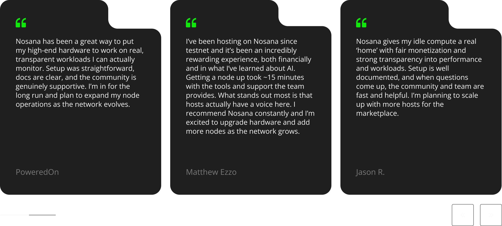
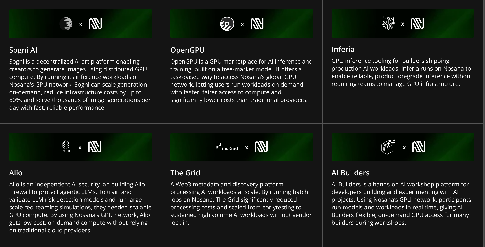
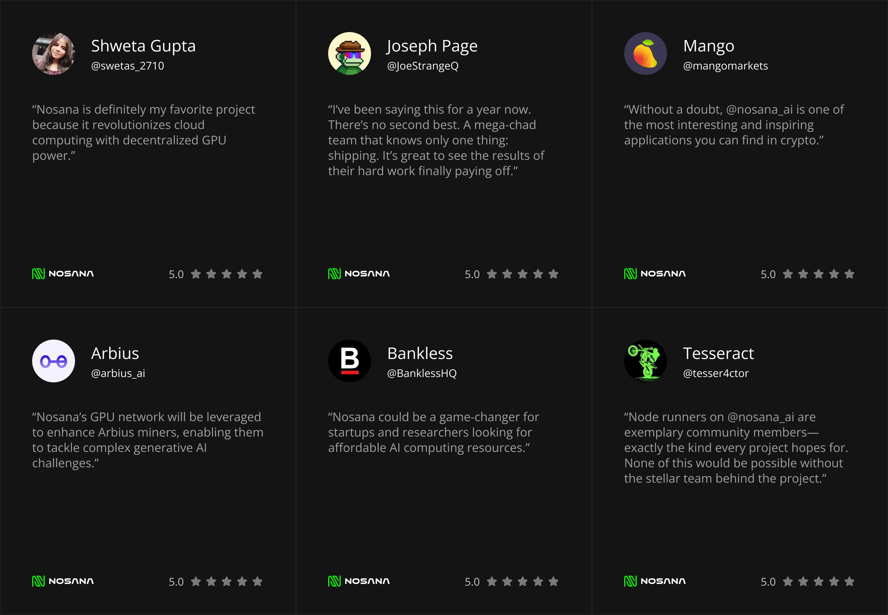

# How to Add a Testimonial

This document explains how contributors can add a new testimonial to the website. Testimonials are frontmatter-only and do not require any Markdown body content.

There are three testimonial types, each used in a different section of the website:

| Type     | Usage                             |
| -------- | --------------------------------- |
| `stack`  | Displays data in 2 sections.      |
| `grid`   | Displays data in 2 grid variants. |
| `slider` | Displays data in 1 section.       |

---

## Step 1 — Create a Folder

Create a new folder inside the `testimonials` content directory. The folder name should be a slug of the author, company, or handle being featured.

Slug rules:

- Lowercase only
- Replace spaces, emojis, and special characters with `-`

Example:

| Author / Company | Folder Name   |
| ---------------- | ------------- |
| Bankless         | `bankless`    |
| AI Builders      | `ai-builders` |
| Alfie            | `alfie`       |

---

## Step 2 — Add Frontmatter

Inside the folder, create an `index.md` file and add a frontmatter block for the relevant type. See the type-specific examples below.

---

## Step 3 — Add Images (if applicable)

For `stack` and `grid` types, place all image assets inside an `assets` folder within the content folder and reference them using relative paths.

`slider` does not use images.

```
src/content/testimonials/
└── bankless/
    ├── index.md
    └── assets/
        └── bankless.png
```

---

## Folder Structure

```
src/content/testimonials/
├── alfie/
│   └── index.md
├── ai-builders/
│   ├── index.md
│   └── assets/
│       ├── builders.svg
│       └── buildersWhite.svg
└── bankless/
    ├── index.md
    └── assets/
        └── bankless.png
```

---

## Type: `slider`

Used in the slider section. No images required.



```yaml
---
type: "slider"
title: "Alfie"
description: "Nosana lets me keep making effective use of my solar-powered computing capacity in a market where traditional mining and hardware rental are no longer very profitable."
---

```

### Fields

#### `type`

**Type:** string  
**Required:** Yes  
**Value:** Must be `"slider"`.

---

#### `title`

**Type:** string  
**Required:** Yes  
The name of the person or company giving the testimonial.

---

#### `description`

**Type:** string  
**Required:** Yes  
The testimonial text.

---

## Type: `grid`

Used in the grid section.




```yaml
---
type: "grid"
icon: "./assets/builders.svg"
title: "AI Builders"
description: "AI Builders is a hands-on AI workshop platform for developers building and experimenting with AI projects."
---

```

### Fields

#### `type`

**Type:** string  
**Required:** Yes  
**Value:** Must be `"grid"`.

---

#### `icon`

**Type:** image  
**Required:** Yes  
A relative path to the icon used on the homepage and testimonials page variants. Must be placed inside `./assets/`.

---

#### `title`

**Type:** string  
**Required:** Yes  
The name of the person or company giving the testimonial.

---

#### `description`

**Type:** string  
**Required:** Yes  
The testimonial text.

---

## Type: `stack`

Used in two stack sections on the website. Supports a logo image, rating, and social handle.




```yaml
---
type: "stack"
order: 6
name: "Bankless"
username: "BanklessHQ"
logo: "./assets/bankless.png"
message: "Nosana could be a game-changer for startups and researchers looking for affordable AI computing resources."
rating: 5.0
---

```

### Fields

#### `type`

**Type:** string  
**Required:** Yes  
**Value:** Must be `"stack"`.

---

#### `order`

**Type:** number  
**Required:** Yes  
Controls the display order of the testimonial within the stack. Lower numbers appear first.

---

#### `name`

**Type:** string  
**Required:** Yes  
The display name of the person or organisation.

---

#### `username`

**Type:** string  
**Required:** Yes  
The social media handle of the author, without the `@` prefix.

---

#### `logo`

**Type:** image  
**Required:** Yes  
A relative path to the logo or avatar image. Must be placed inside `./assets/`.

---

#### `message`

**Type:** string  
**Required:** Yes  
The testimonial text.

---

#### `rating`

**Type:** number  
**Required:** Yes  
A rating value out of 5.0.

---

## Summary

1. Create a folder inside `src/content/testimonials/` using a slug of the author or company name.
2. Add an `index.md` file with a frontmatter block matching the correct type (`slider`, `grid`, or `stack`).
3. For `grid` and `stack`, place image assets inside `./assets/`.
4. No Markdown body content is required.
