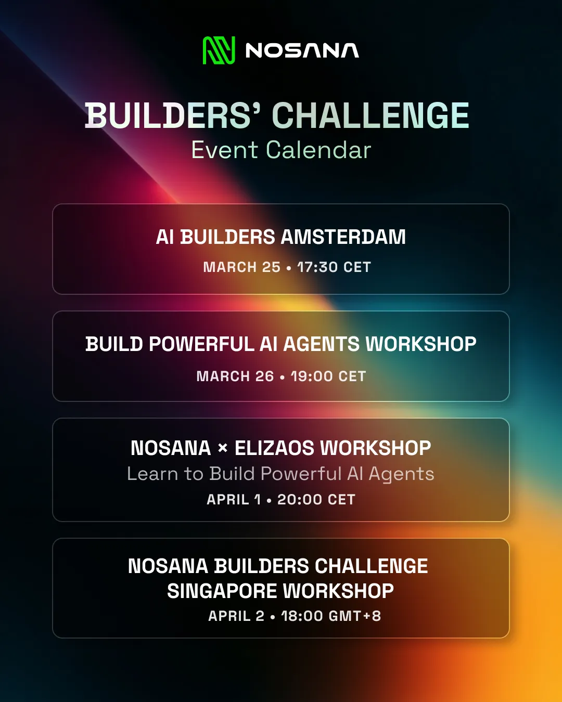

The Nosana Builder Challenge is back! We're excited to announce the **Nosana x ElizaOS Agent Challenge** — a developer challenge where you'll build personal AI agents using the ElizaOS framework and deploy them on Nosana's decentralized GPU network.

This challenge draws inspiration from the OpenClaw movement, emphasizing individual control over your infrastructure, tasks, and data.

## Quick Details

- **Prize Pool**: $3,000 USDC for top 10 submissions
- **Submission Deadline**: April 14, 2026
- **Submission Platform**: [SuperTeam Builders Challenge Page](https://earn.superteam.fun/listing/nosana-builders-elizaos-challenge)
- **GitHub Repository**: [Agent Challenge Starter](https://github.com/nosana-ci/agent-challenge/tree/elizaos-challenge)
- **Dashboard**: [deploy.nosana.com](https://deploy.nosana.com)

## Your Mission

Build a personal AI agent that automates your life or solves real problems using:

- **ElizaOS framework (v2)** for agent orchestration
- **Qwen3.5-27B-AWQ-4bit** model (hosted endpoint provided)
- **Custom frontend/UI** to interact with your agent
- **Node.js 23+** and modern web technologies

Then deploy your complete stack on Nosana's decentralized GPU network — no traditional cloud allowed!

## Agent Ideas to Inspire You

Build something personal — an agent that helps YOU or your community! Here are some ideas:

- 🤖 **Personal Assistant** - Schedule management, email drafting, daily task automation
- 📊 **Research Agent** - Aggregate information, summarize findings, knowledge synthesis
- 📱 **Social Media Manager** - Auto-post content, engage with followers, track trends
- 💰 **DeFi/Crypto Monitor** - Track portfolios, alert on price movements, transaction automation
- 🏠 **Home Automation** - Control smart devices, optimize energy usage, security monitoring
- 🛠️ **DevOps Helper** - Monitor services, automate deployments, infrastructure management
- 🎨 **Content Creator** - Generate posts, blog outlines, marketing copy with your voice
- 🧠 **Learning Companion** - Personalized study plans, quiz generation, knowledge retention
- 📽️ **Video Agent** - Video agent to create content, or mix and rematch video content

**Think Personal!** The best agents act as true extensions of yourself.

## Schedule

Take a look at our schedule here: [Luma Nosana](https://luma.com/calendar/cal-RF19mq3EtF4juLc)



## The Framework: ElizaOS

We're using [ElizaOS](https://github.com/elizaos/eliza) (v2), the powerful multi-agent simulation framework built in TypeScript. ElizaOS provides everything you need to build autonomous agents with personality, memory, and the ability to interact across multiple platforms.

**New to ElizaOS?** Check out these resources:

- [ElizaOS Documentation](https://elizaos.github.io/eliza/)
- [ElizaOS GitHub Repository](https://github.com/elizaos/eliza)
- [Getting Started Guide](https://elizaos.github.io/eliza/docs/intro)

## Getting Started

### Step 1: Register & Get Credits

1. Star the required repos: [Agent Challenge](https://github.com/nosana-ci/agent-challenge), [Nosana CLI](https://github.com/nosana-ci/nosana-cli), [Nosana SDK](https://github.com/nosana-ci/nosana-sdk), [ElizaOS](https://github.com/elizaos/eliza)
2. Sign up at [nosana.com/builders-credits](https://nosana.com/builders-credits) to receive free Nosana credits (airdropped twice daily!)
3. Register at [SuperTeam](https://earn.superteam.fun/listing/nosana-builders-elizaos-challenge)

### Step 2: Fork & Build

Fork the [challenge repository](https://github.com/nosana-ci/agent-challenge) and checkout the `elizaos-challenge` branch to start building your agent.

```bash
# Fork this repo on GitHub, then clone your fork
git clone https://github.com/YOUR-USERNAME/agent-challenge
cd agent-challenge

# Set up your environment
cp .env.example .env

# Install dependencies
bun i -g @elizaos/cli

# Start your agent in development mode
elizaos dev
```

### Step 3: Deploy to Nosana

Build your Docker container and deploy your complete stack to the Nosana GPU network using the [Nosana Dashboard](https://deploy.nosana.com). **Important**: You must deploy to Nosana infrastructure — traditional cloud deployments are not eligible.

### Step 4: Submit

Before the April 14, 2026 deadline, submit your project on the [SuperTeam Challenge Page](https://earn.superteam.fun/listing/nosana-builders-elizaos-challenge) with:

- Public GitHub fork link
- Working Nosana deployment URL
- Agent description (max 300 words)
- Video demo (under 1 minute)
- Social media post with #NosanaAgentChallenge and @nosana_ai tag

## Minimum Requirements

Your submission **must** include:

- ✅ **ElizaOS Agent** - Built with https://docs.elizaos.ai/
- ✅ **Frontend/UI** - Custom interface to interact with your agent
- ✅ **Deployed on Nosana** - Running on Nosana GPU network (no traditional cloud)
- ✅ **Docker Container** - Properly containerized application
- ✅ **Public GitHub Fork** - Your forked repository must be public
- ✅ **Video Demo** - Under 1 minute demonstration of your deployed agent
- ✅ **Agent Description** - Max 300 words explaining your agent
- ✅ **Social Media Post** - Share on X/BlueSky/LinkedIn with #NosanaAgentChallenge and tag @nosana_ai
- ✅ **Starred Repositories** - All four required repos must be starred

## Prizes

**Top 10 submissions will be rewarded:**

- 🥇 1st Place: $1,000 USDC
- 🥈 2nd Place: $750 USDC
- 🥉 3rd Place: $450 USDC
- 🏅 4th Place: $200 USDC
- 🏅 5th-10th Place: $100 USDC each

## Judging Criteria

Submissions evaluated on 5 key areas:

### Technical Implementation 💻 (25%)

Code quality, proper use of ElizaOS framework, efficient implementation, error handling

### Nosana Integration ⚡ (25%)

Deployment depth, resource efficiency, stability and performance, proper containerization

### Usefulness & UX 🎯 (25%)

Practical value, user experience quality, interface design, ease of use

### Creativity & Originality 🎨 (15%)

Novel agent concepts, innovative problem-solving, unique approaches

### Documentation 📝 (10%)

Clear README, well-commented code, setup instructions, usage guidelines

## Support & Resources

- **Discord**: Join [Nosana Discord](https://nosana.com/discord)
- **Dev Chat**: [Builders Challenge Channel](https://discord.com/channels/236263424676331521/1354391113028337664)
- **Twitter**: Follow [@nosana_ai](https://x.com/nosana_ai)
- **Docs**: [Nosana Documentation](https://learn.nosana.io) | [ElizaOS Docs](https://elizaos.github.io/eliza/)
- **Dashboard**: [deploy.nosana.com](https://deploy.nosana.com)
- **Builder Credits**: [nosana.com/builders-credits](https://nosana.com/builders-credits)

Good luck, builders! We can't wait to see the personal AI agents you create on the Nosana decentralized GPU network.

**Happy Building!**

---

Want access to exclusive builder perks, early challenges, and Nosana credits?
Subscribe to our newsletter and never miss an update.

👉 [ Join the Nosana Builders Newsletter ](https://e86f0b9c.sibforms.com/serve/MUIFALaEjtsXB60SDmm1_DHdt9TOSRCFHOZUSvwK0ANbZDeJH-sBZry2_0YTNi1OjPt_ZNiwr4gGC1DPTji2zdKGJos1QEyVGBzTq_oLalKkeHx3tq2tQtzghyIhYoF4_sFmej1YL1WtnFQyH0y1epowKmDFpDz_EdGKH2cYKTleuTu97viowkIIMqoDgMqTD0uBaZNGwjjsM07T)

Be the first to know about:

- 🧠 Upcoming Builders Challenges
- 💸 New reward opportunities
- ⚙ Product updates and feature drops
- 🎁 Early-bird credits and partner perks

Join the Nosana builder community today — and build the future of decentralized AI.
