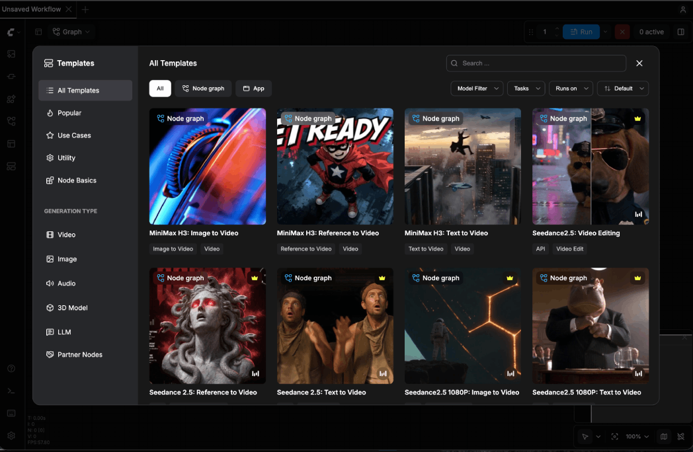
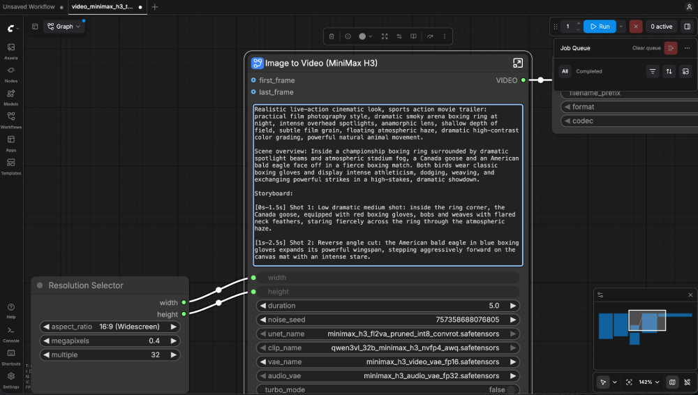
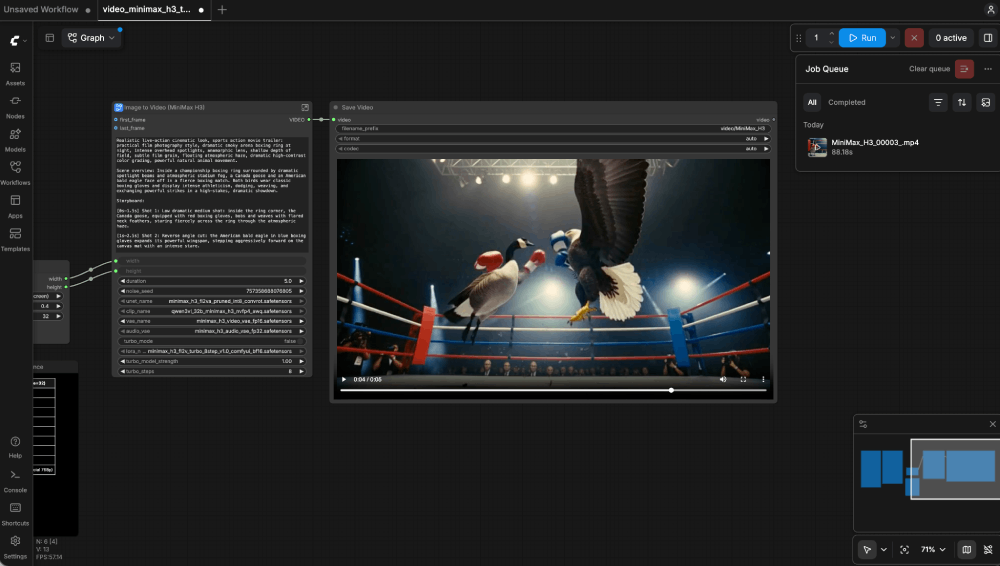

AI video generation is moving beyond simply turning a text prompt into a few seconds of motion. Creators increasingly want more control over how a scene starts, where it ends, how the camera moves, and what the finished video sounds like.

**MiniMax H3** is built for exactly that.

H3 is MiniMax’s open weight audiovisual generation model. You can generate a video from text, animate an existing image, define the first and last frames of a scene, or use images, video, and audio as references. H3 generates the visuals and native audio together, making it possible to create dialogue, ambience, environmental sounds, and motion as part of the same generation.

For video creators, AI artists, creative teams, and developers, that opens up workflows that go well beyond basic text to video.

And with **Nosana**, you can run MiniMax H3 on GPU infrastructure without having to configure the entire serving environment yourself. Choose a GPU, launch the ready to use H3 template, and start generating from your own endpoint.

[**Try MiniMax H3 on Nosana**](https://deploy.nosana.com/deployments/create?template=minimax-h3-i2v-32gb)

# **What is MiniMax H3?**

MiniMax H3 is an open weight AI model designed for **native video and audio generation**.

It can generate clips between 4 and 15 seconds at 24 FPS with synchronized 32 kHz stereo audio.

H3 Base generates video at 768p. MiniMax also provides a separate **H3 Regenerate 2K** workflow for taking selected generations to a higher resolution. But the specifications are only part of what makes H3 interesting.

The bigger difference is the amount of **creative control** you can give the model.

You can start with nothing but a text prompt. You can give H3 an image and turn it into a moving scene. You can provide both the opening and closing frames and let H3 create what happens between them.

With the Ref2VA variant, you can go further and use combinations of images, video, and audio as references for a new generation.

Instead of trying to explain everything you want through text, you can actually **show the model more of your creative direction**.

**What can you create with MiniMax H3?**

MiniMax H3 supports several ways to generate and control video, depending on the kind of input you want to use.

### **Image to video**

Start with an existing image and use it as the first frame. This works well for animating AI art, product visuals, character designs, or campaign assets without recreating the scene from text.

### **First and last frame control**

Provide both the opening and closing frame, and H3 generates the sequence between them. This is useful for product reveals, transformations, transitions, and shots where the ending matters.

### **Video with native audio**

H3 generates audio alongside the video, including dialogue, ambience, footsteps, environmental sound, and other audio cues. That means you can direct the scene and its sound together instead of adding audio later.

### **Multimodal references**

With H3 Base Ref2VA, you can guide generations using images, video, and audio references. It supports up to 9 images, 3 video clips, 3 audio clips, and 12 files across mixed input types.

# **How to use MiniMax H3 on Nosana**

Running a large video generation model normally means dealing with the infrastructure before you get anywhere near your first generation.

With Nosana, you can skip much of that setup.

MiniMax H3 is available as a ready to use deployment, so you can launch the model directly from the Nosana Dashboard\!

### **Step 1: Open the MiniMax H3 template**

Open the H3 deployment directly in the Nosana Dashboard:

[**Launch MiniMax H3**](https://deploy.nosana.com/deployments/create?template=minimax-h3-i2v-32gb)

### **Step 2: Choose your GPU**

Select the GPU you want to use.

MiniMax H3 can be deployed on Blackwell GPUs available on Nosana, including the **RTX 5090 and RTX PRO 6000**. For most generations, we recommend starting with the RTX 5090\.

### **Step 3: Create your deployment**

Click **Create Deployment** and allow the workload to initialize.

Once the deployment is running, you'll see a **Service URL**.

You can use that endpoint to start working with the model and integrate H3 into your own creative workflow.

That's it.

You don't need to manually build the serving environment just to start experimenting with MiniMax H3.

[How to Deploy MiniMaxH3 on Nosana GPUs (short walkthrough)](https://www.youtube.com/watch?v=gjcEJ6Qc0Vc)

Prefer a more detailed, step-by-step guide?

[How To Use MiniMax H3 in ComfyUI on Nosana GPUs](https://www.youtube.com/watch?v=5mECpfW1Ae8)

---

# **Which MiniMax H3 generation mode should you use?**

The first time you look at H3's generation modes, the names can make the model seem more complicated than it actually is.

**T2VA. I2VA. FL2VA. L2VA. Ref2VA.**

The easiest way to choose is simply to ask what material you already have and how much control you want.

| If you want to...                                   | Use        |
| --------------------------------------------------- | ---------- |
| Create a complete video from a prompt               | **T2VA**   |
| Animate an existing image                           | **I2VA**   |
| Control both the beginning and end                  | **FL2VA**  |
| Generate a scene that finishes on a specific image  | **L2VA**   |
| Use images, videos, or audio as creative references | **Ref2VA** |

## **Text to Video: T2VA**

This is the most familiar AI video generation workflow.

Describe the scene you want and let H3 generate the audiovisual sequence from your prompt.

You have the most creative freedom here because you don't need any source material. At the same time, the model has to make more decisions for you, which makes a detailed prompt particularly important.

## **Image to Video: I2VA**

If you already have an image you want to animate, use it as the starting frame.

H3 develops the scene forward while using that image as its visual foundation.

This can be especially useful for AI artists and visual creators. You can perfect the static image first using your preferred image generation workflow and then bring it into H3 when you're ready to add motion and audio.

## **First and Last Frame to Video: FL2VA**

FL2VA gives you more control over the direction of a generation.

Instead of providing only a starting image, you provide both the first and last frames.

H3 then generates the sequence connecting them.

For product videos, transformations, visual transitions, before and after scenes, and shots with a deliberate ending, this can be more predictable than pure text to video generation.

## **Last Frame to Video: L2VA**

Sometimes the ending matters more than the beginning.

With L2VA, you provide the desired final frame and H3 generates a plausible audiovisual sequence that leads toward it.

## **Multimodal Reference to Video: Ref2VA**

Ref2VA is useful when a prompt alone doesn't communicate enough about the result you want.

Instead of relying entirely on text, you can bring images, video, and audio into the generation as references.

This gives creators a richer way to communicate visual identity, movement, sound, and other aspects of a scene.

---

# **How to write better MiniMax H3 prompts**

Prompting a video model is different from prompting a text model.

If you give a language model a vague instruction, trying again costs very little.

Video generation consumes significantly more GPU compute. Generating five or ten videos simply because the original prompt was underspecified is an expensive way to iterate.

With H3, it pays to spend more time thinking about the shot **before you generate it**.

### **Think like a director, not an image prompter**

Consider this:

> A woman walks through a futuristic city at night.

We know the subject and the setting.

But almost everything else is still open to interpretation.

Where is the camera? How quickly is she walking? Is the camera following her? What is happening in the background? What kind of lighting are we seeing? Is the street quiet or crowded? What can we hear?

The model has to make those decisions.

Compare it with:

> A woman wearing a dark silver coat walks slowly through a rain covered neon street at night. Medium tracking shot from slightly below eye level. The camera moves backward smoothly as she approaches. Blue and magenta signs reflect across the wet pavement while pedestrians move behind her in soft focus. Light rain falls throughout the shot. Her footsteps are clearly audible over distant traffic and a low electrical hum from the storefront signs. Cinematic lighting, shallow depth of field, restrained camera movement.

The second prompt isn't better simply because it's longer.

It's better because it gives H3 more information about **composition, movement, environment, camera behavior, and sound**.

### **A simple framework for H3 prompts**

When you're writing a prompt, think about a few elements:

**Subject:** Who or what are we watching?

**Action:** What is happening during the clip?

**Environment:** Where does the scene take place?

**Camera:** Is it a close up, wide shot, tracking shot, handheld shot, or static camera?

**Movement:** How does the subject move? How does the camera move?

**Lighting and style:** Cinematic, commercial, documentary, natural daylight, neon, soft studio lighting?

**Audio:** What should we hear as the scene develops?

You don't need to mechanically include every category in every prompt.

The important shift is to stop thinking about video prompting as **describing a picture**.

You're describing a scene that changes over time.

> **Simple prompt**

[Structured_Prompt.mp4](https://drive.google.com/file/d/1-ki2F7hsfr7s0Yyg3Cmms4vEiJMfhekU/view?usp=sharing)

```
Cinematic chase scene on rooftops at dusk, a man leaping between skyscrapers with people chasing him, flying cars in the background.
```

> **Structured prompt**

[Structured_Prompt.mp4](https://drive.google.com/file/d/1-ki2F7hsfr7s0Yyg3Cmms4vEiJMfhekU/view?usp=sharing)

```
Realistic live-action cinematic look, action movie trailer: practical film photography style, a post-rain dusk metropolis, anamorphic lens, shallow depth of field, film grain, city volumetric fog, flying-car traffic between the towers, restrained grading for a premium feel, powerful natural movement.

Scene overview: at dusk on a cluster of skyscrapers, the protagonist is being chased, sprinting and leaping across rooftops, jumping from one building's roof to the next with pursuers closing in behind. This is the escape sequence of an action movie trailer: every leap is life-or-death, thrilling and fluid.

Storyboard (each shot a separate scene, rapid cuts, all landing on the musical beats):
[0s-1.5s] Shot 1: high side angle: the protagonist sprinting at the roof edge, pursuers appearing in the rooftop doorway behind him, wind catching his coat.
[1s-2.5s] Shot 2: the protagonist leaps across the gap between buildings, body stretching mid-air, towers and flying-car light trails behind him, a slight slow-motion feel.
[2.5s-4s] Shot 3: he lands, rolls and rises, low-angle shot, tower shadows and fog behind him, he keeps running.
[4s-5s] Shot 4: freeze: the instant he hits the edge of the next roof and launches into the jump, silhouette, holding.

Camera: each shot its own angle, cuts clean and hard, no dissolves, a slight frame jitter on the jumps.

Audio: wind, rapid footsteps, city ambience, low score underneath, an accent hit on each leap, the score bursting at 4s, closing the last 1s.

No text, subtitles, logos or watermarks of any kind, no animation or cartoon rendering, no overly-CG look, keep the live-action texture.
```

---

# **Get help writing MiniMax H3 prompts**

You don't necessarily need to write every detailed H3 prompt manually.

MiniMax also provides an official **H3 prompt writing skill** that packages its prompting guidance for compatible AI assistants and agent environments.

You can start by describing the video you want in normal language, then use an AI assistant to help turn the idea into a more structured H3 prompt.

For creators producing multiple concepts or variations, this can make the prompting stage considerably faster.

[**Read the MiniMax H3 Prompt Writing Guide**](https://huggingface.co/MiniMaxAI/MiniMax-H3/blob/main/docs/VIDEO_PROMPT_WRITING_GUIDE_base_en.md)

[**Explore the H3 Prompt Writing Skill**](https://github.com/MiniMax-AI/MiniMax-H3/tree/main/skills)

---

### **MiniMax H3 video length, resolution, and audio**

Here are the main output specifications to keep in mind:

**Video length:** 4 to 15 seconds

**Frame rate:** 24 FPS

**Audio:** Native 32 kHz stereo

**H3 Base resolution:** 768p

**Higher resolution:** H3 Regenerate 2K

One distinction here is particularly important.

H3 Base and H3 Regenerate 2K are separate stages.

You first create the video using H3 Base. If you have a generation worth taking further, the H3 Regenerate 2K workflow can use the result and its original context to produce a higher resolution version.

For creators, this lends itself to a sensible workflow:

**Experiment → choose your strongest generations → take the winners to higher resolution.**

You don't necessarily need to spend additional compute on every idea you test.

---

## **ComfyUI: Load the MiniMax H3 Text-to-Video Workflow**

In ComfyUI, click **Templates** in the left sidebar. Under **Generation Type**, choose **Video**, then select **MiniMax H3: Text to Video**.



Paste your prompt in the dialogue box



Run and Review the Result

1. Click **Run** in the top-right corner.
2. Monitor the job queue as ComfyUI processes your audiovisual generation.
3. Once the job completes, use the **Save Video** player to inspect your clip.
4. Review both the picture and audio. Ensure the playback is smooth, clear, and that the result captures your core prompt intent.
5. If you want a variation, adjust the noise seed and run the generation again. While a reused seed produces similar results, every generation is unique.



# **MiniMax H3 hardware requirements on Nosana**

MiniMax H3 is a large audiovisual model, so GPU memory and the serving configuration matter.

For the current Nosana H3 template, we recommend the **RTX 5090**.

Nosana's deployment uses an optimized serving configuration designed to make running H3 accessible through the GPU infrastructure available on the network.

The [RTX-5090 is currently priced at $0.40 per hour](https://explore.nosana.com/markets/6Xt8hgVLLL2PSHC9NtJP8E8oTdA5ZJc95hZEnHcdqKqb).

Deploying the MiniMaxH3 model alongside the ComfyUI web interface on Nosana requires roughly a 4-minute cold startup time.

Rendering a 5-second video using the RTX-5090 takes approximately 2 minutes, resulting in a cost of $0.0133 per 5-second clip.

Alternatively, this cost breaks down as follows:

- 75 video generations per dollar
- Approximately $0.16 per minute of completed video content

These numbers will make this section considerably more useful for creators deciding whether H3 fits their workflow.

### **Can you use MiniMax H3 commercially?**

MiniMax H3 is an **open weight model** distributed under the MiniMax H3 Community License Agreement. If you're planning to use H3 in a commercial product or service, review the license conditions before deploying it.

[Read the MiniMax H3 license](https://huggingface.co/MiniMaxAI/MiniMax-H3/blob/main/LICENSE?utm_source=chatgpt.com)

---

### **Start generating with MiniMax H3**

Ready to try it? Launch the MiniMax H3 template on Nosana, choose your GPU, and start generating.

[Run MiniMax H3 on Nosana](https://deploy.nosana.com/deployments/create?template=minimax-h3-i2v-32gb&utm_source=chatgpt.com)

Need a more custom compute setup? **Get in touch with the Nosana team and we’ll help you find the right setup for your workload.**

## Useful Links

- [Nosana Website](https://nosana.com/)
- [**Try MiniMax H3 on Nosana**](https://deploy.nosana.com/deployments/create?template=minimax-h3-i2v-32gb)
- [Nosana Minimax H3 Template](https://deploy.nosana.com/deployments/create?template=minimax-h3-i2v-32gb)
- [Join the Discord](https://nosana.com/discord)
- [Follow us on X](https://nosana.com/twitter/)
- [Nosana on GitHub](https://nosana.com/github/)
- [Nosana Grants Program](https://nosana.com/grants)
