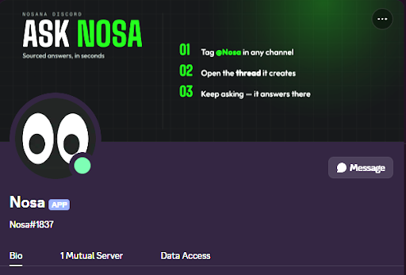

When you're deploying a model or setting up a GPU node, finding the right answer should help you move forward without interrupting your workflow. Nosana's documentation and community support history already hold years of practical knowledge, but locating the guidance that fits your situation can take time.

Meet Nosa, Nosana's AI community helper, now live in beta in our [Discord server](https://nosana.com/discord). Built on our documentation and thousands of previously solved support cases, Nosa helps you find answers in seconds, with sources you can check and clear guidance when a question needs the team's input.

## Nosana's Knowledge, Within Reach

Nosa draws from a curated knowledge base that includes Nosana's documentation, SDK and CLI reference, on-chain interfaces, and real support cases the community has already solved. This gives it specific context for questions about deploying workloads, running a GPU node, and understanding how the network works.

You can ask a question in plain language without knowing which documentation page contains the answer. Whether you're exploring your first deployment, working with the SDK, or looking into a node setup issue, Nosa helps connect your question to the relevant guidance.

For builders, that means easier access to deployment instructions and technical references. For GPU providers, it means finding setup requirements and documented troubleshooting advice, including solutions that have helped other hosts.

## Practical Answers With Sources

Nosa provides source links alongside its answers so you can read the underlying guidance and check how it applies to your situation. Having the reference close at hand makes it easier to understand a recommendation before making changes to your deployment or node.

Community support history adds another layer of practical context. A problem you're facing may already have been investigated and resolved by another builder or provider, and Nosa can draw on that knowledge when it is relevant to your question.

A solution that worked for one setup may still need a closer look before being used on another. Nosa is instructed to avoid guessing at risky fixes and to recommend checking with the team when a suggestion could cost significant time or affect your hardware.

## Clear About Its Limits

Knowing when to ask for help is part of providing useful support. When Nosa's knowledge base does not contain an answer, it is instructed to acknowledge that gap and direct you toward someone who can help.

Nosa also has no live access to token prices, host earnings, or network statistics. If you ask for current figures, it will point you to [Explore](https://explore.nosana.com/) or your [host dashboard](https://host.nosana.com/), where you can check the relevant information yourself.

Its role is to help you understand and use Nosana, so it does not provide price predictions, valuation opinions, or financial, legal, or compliance advice. Technical questions that need further investigation remain a job for the team and community, with Nosa helping you find the right starting point.

## Keeping Your Wallet Information Private

Nosa will never ask for your private key, seed phrase, or keypair file, and nobody from the Nosana team will ask for them either. These details should stay private, including when you are seeking help with a wallet or troubleshooting your node.

If someone contacts you by DM claiming to represent Nosana and offering to recover a lost wallet, treat it as a scam. You should never need to hand over wallet credentials to get community support.

## Tested Before Launch, Improved Through Feedback

Before bringing Nosa to the community, we tested it across five user personas and fifty conversations, evaluating accuracy, judgement, and speed. The test suite included difficult situations, such as a distressed host who had lost their keypair and a researcher asking for help with a workload that should be refused.

Those conversations helped us identify problems and improve Nosa's responses before launch. They also reinforced why clear limits, source references, and human support need to be part of the experience.

Nosa is still early and can get things wrong. If an answer is incorrect, unclear, or missing useful context, flagging it helps us identify what needs to improve. Your feedback will help make it more useful for the next person who encounters the same question.

## Start a Conversation With Nosa

You can now ask Nosa questions in the Nosana Discord server. Explain what you're trying to do and include relevant technical context, while keeping private keys, seed phrases, and other secrets out of the conversation.

You might ask how to get started with a deployment, where to find GPU node requirements, or whether there is a documented explanation for an error you're seeing. Nosa will use its available knowledge to guide you, provide sources you can review, and point you toward human support when needed.

Our community has spent years sharing solutions and helping each other build. With Nosa, that collective knowledge becomes easier to access whenever you need it.

Ready to get started? [Join the Nosana Discord](https://nosana.com/discord) and ask Nosa your first question about deploying or hosting.

## Useful Links

- [Nosana Website](https://nosana.com/)
- [Join the Discord](https://nosana.com/discord)
- [Follow us on X](https://nosana.com/x)
- [Nosana on GitHub](https://nosana.com/github)
- [Nosana Grants Program Page](https://nosana.com/grants)
