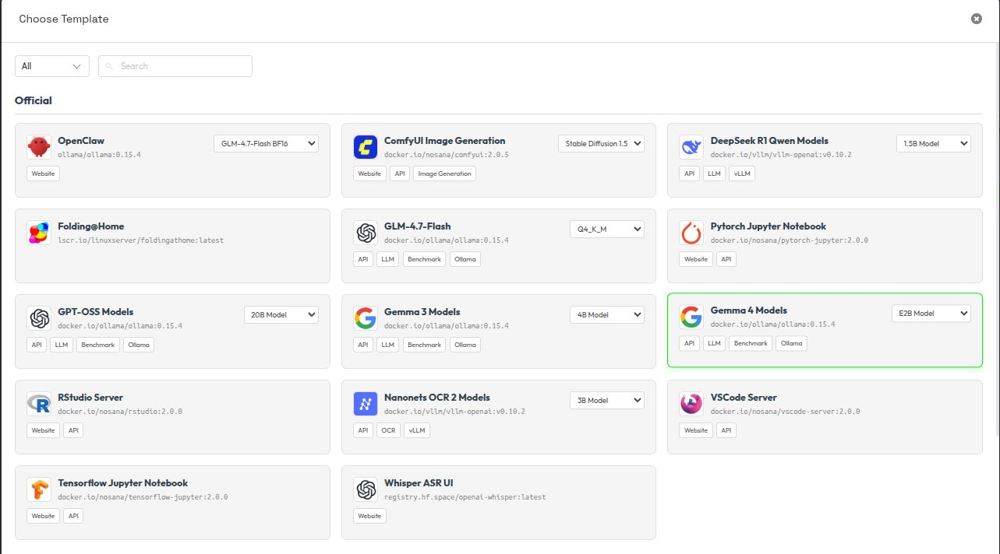
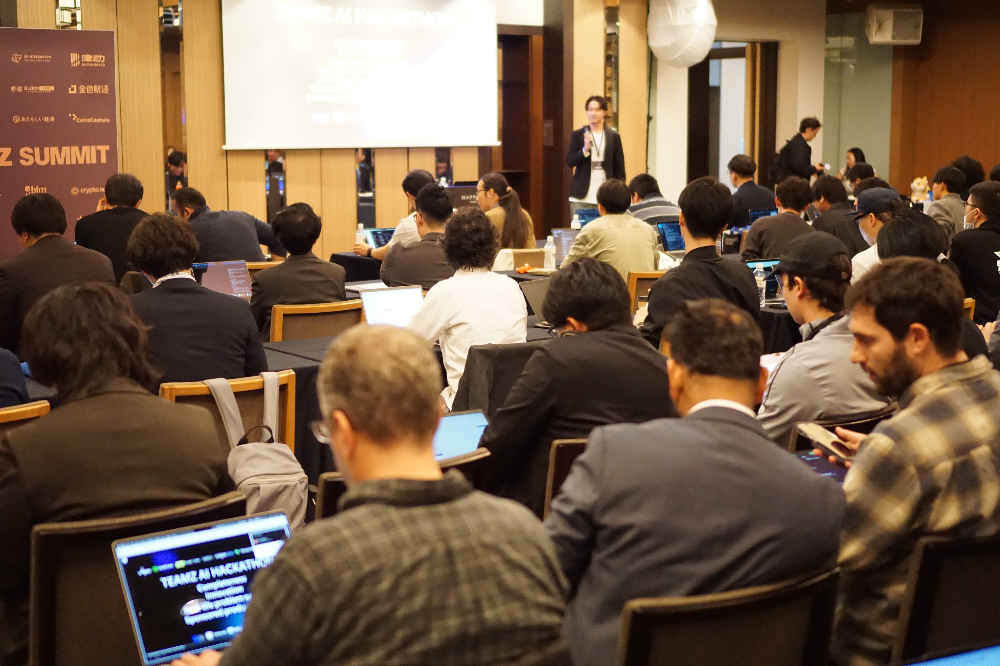
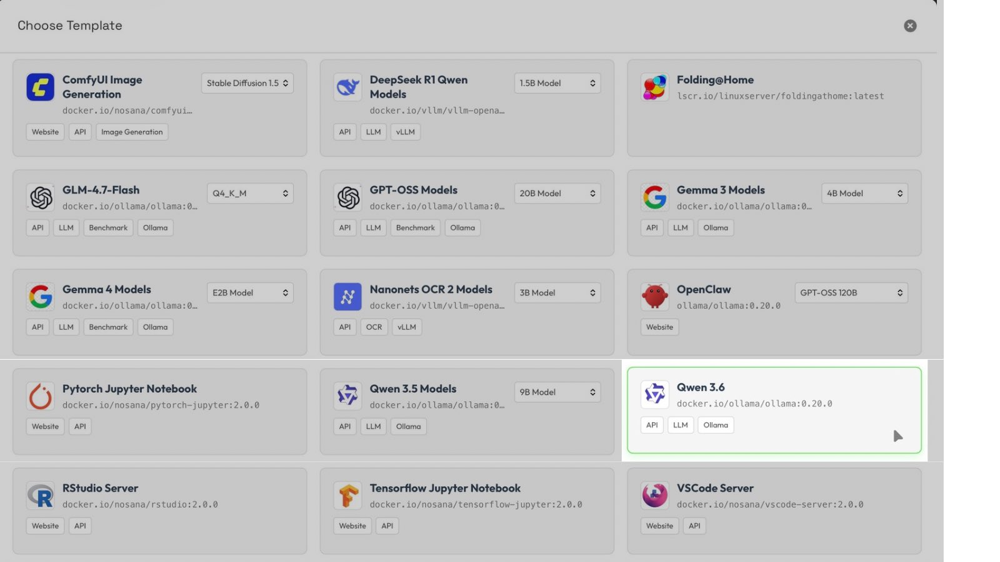
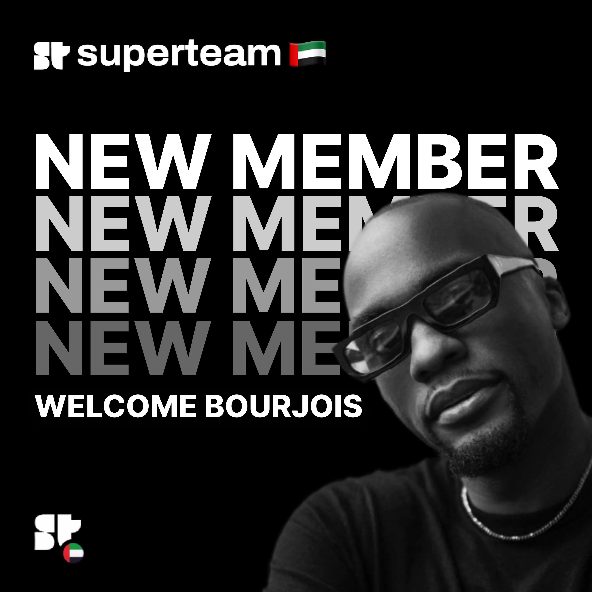

April was a packed month for Nosana, with major momentum across the builder ecosystem, product improvements, new model deployments, partnerships, hackathons, and community updates.

From wrapping our biggest Builders’ Challenge yet to launching new templates on Nosana Deployments, April showed how quickly the ecosystem is growing around open GPU compute and real AI applications.

Here’s what happened.

## **Builders’ Challenge 4 Wrapped With 105 Submissions**

One of the biggest highlights of the month was the fourth Nosana Builders’ Challenge.

This edition brought together builders from around the world to create AI agents, tools, and autonomous applications powered by Nosana GPU compute. The result was our biggest challenge yet.

The challenge generated strong momentum across the ecosystem:

- 105 submissions via Superteam
- Builders from 32 distinct countries
- A wide range of high-quality AI agent use cases
- Strong participation from developers building with real infrastructure

The projects went far beyond simple prototypes. Builders created practical applications, AI agents, dashboards, workflows, and tools that showed what is possible when developers have access to flexible GPU compute.

Read the [full Builders’ Challenge 4 recap](https://nosana.com/blog/builders-challenge-4-wrapup/) to explore the highlights and use cases.

## **Deployment Logs Got a Major Upgrade**

Nosana Deployments also received an important product update in April: the deployment log view got an upgrade.

All job logs now live in one place, making it much easier to track, search, and debug deployments.

Builders can now:

- Search across multiple jobs
- Filter logs more easily
- Scroll through older logs automatically
- Debug workloads from one unified view

This update makes the deployment experience smoother, especially for builders running multiple jobs or testing more complex AI workloads.

You can try the upgraded log experience directly in [Nosana Deployments](https://deploy.nosana.com).

## **Gemma 4 Is Now Available on Nosana**

Gemma 4 from Google DeepMind is now available to run on Nosana.

Built for advanced reasoning and agentic workflows, Gemma 4 gives developers another powerful model option for building AI applications on Nosana’s GPU network.

The model is fully open under Apache 2.0 and can be launched directly from Nosana Deployments.

To get started, go to [Nosana Deployments](https://deploy.nosana.com), select the Gemma 4 template, and launch it instantly.

## **Nosana Partnered With Zeroquery**

April also brought a new partnership with Zeroquery.

Zeroquery is building autonomous trading agents that can execute strategies independently, manage their own resources, and operate under real economic constraints.

Powered by Nosana’s GPU network, this collaboration highlights a key direction for AI agents: systems that do not just generate outputs, but actively operate in live environments with real resource requirements.

This is a strong example of how Nosana can support AI agents that need scalable, flexible compute to run specialized workloads and power real-world applications.

Read more about the [Nosana and Zeroquery partnership](https://nosana.com/blog/nosana-partners-with-zeroquery).

## **March Community Call Replay Is Available**

The March Community Call is now available to watch for anyone who missed it live.

Community calls are a great way to catch up on recent updates, ecosystem progress, and what the team has been working on across product, partnerships, and builder initiatives.

Watch the [March Community Call replay](https://www.youtube.com/watch?v=6TBe1mFarZk).

## **Nosana Joined the TEAMZ AI Hackathon in Tokyo**

Nosana was also part of the TEAMZ AI Hackathon at Happo-en in Tokyo.

The event brought builders together for a full-day, hands-on build session where teams raced to build customizable OpenClaw AI assistants using a production-ready open stack.

Hackathons like this continue to show the demand for practical AI infrastructure that helps builders move from idea to working application faster.

See more from the [TEAMZ AI Hackathon in Tokyo](https://x.com/theaibuilders/status/2041659340265025632?s=20).

## **Nosana Partnered With Ozak AI**

Nosana also partnered with Ozak AI in April.

Ozak AI is building predictive AI for smarter market signals and advanced financial intelligence. As part of the collaboration, the Nosana x Ozak AI Partner Quest brought the community together around predictive AI, market intelligence, and the role of scalable compute in powering advanced AI workflows.

The campaign helped maintain strong builder momentum and created meaningful engagement around real AI use cases.

Listen to the [Ozak AI and Nosana live session](https://x.com/nosana_ai/status/2046614105268666513?s=20).

## **Qwen 3.6 Is Live on Nosana**

Qwen 3.6 is now available on Nosana.

Built for agentic coding, Qwen 3.6 is designed to support frontend workflows, complex development tasks, and repo-level problem solving.

For builders working on AI agents, coding assistants, or autonomous development workflows, Qwen 3.6 adds another strong model option to the Nosana deployment stack.

To try it, go to [Nosana Deployments](https://deploy.nosana.com), select the Qwen 3.6 template, and run it instantly.

## **Nosana Joined Superteam UAE**

Another exciting update from April: Nosana joined Superteam UAE.

This marks a strong step forward as compute and AI infrastructure become a bigger part of the Solana ecosystem.

Through Superteam UAE, Nosana is looking forward to connecting with more builders, expanding ecosystem opportunities, and supporting more AI applications with open GPU infrastructure.

See the [Superteam UAE announcement](https://x.com/nosana_ai/status/2049418790450958434?s=20).

## **Looking Ahead**

April was full of momentum for Nosana.

The fourth Builders’ Challenge showed the scale and creativity of the global builder community. New model templates like Gemma 4 and Qwen 3.6 made it easier for developers to experiment with advanced AI workloads. Product updates improved the deployment experience. Partnerships with Zeroquery and Ozak AI highlighted real-world AI use cases. And community initiatives across Superteam, TEAMZ, and live sessions helped bring more builders into the ecosystem.

As AI applications become more advanced, the need for accessible, flexible GPU compute continues to grow.

Nosana is helping builders move from ideas to real deployments, and April was another strong step in that direction.

Start building on [Nosana Deployments](https://deploy.nosana.com)

## Useful Links

- [Nosana Website](https://nosana.com/)
- [Join the Discord](https://nosana.com/discord)
- [Follow us on X](https://nosana.com/twitter/)
- [Nosana on GitHub](https://nosana.com/github/)
- [Nosana Grants Program Page](https://nosana.com/grants)
