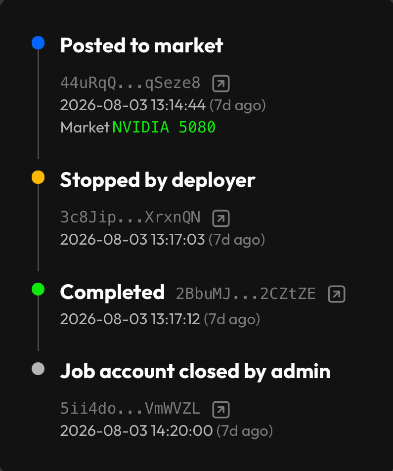
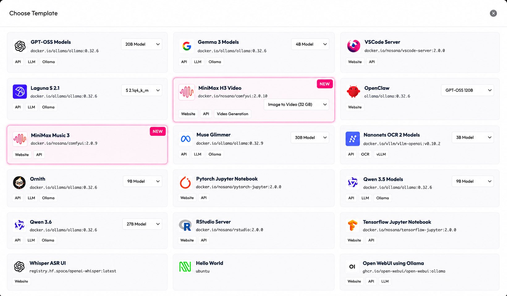
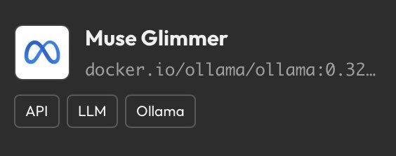
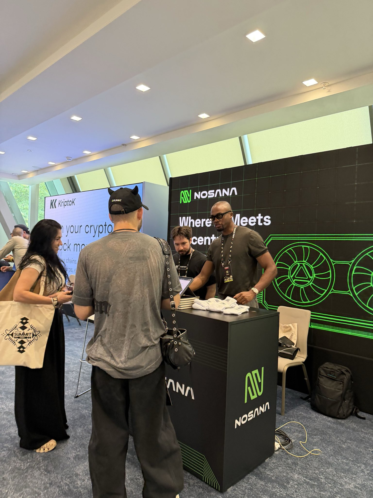

August brought a number of updates across Nosana, from improvements to deployments and Explorer to new models in the template library and developments across the wider ecosystem.

Deployments are now easier to fund and manage, Explorer gives you a clearer view of every stage of a job, and new templates make it faster to start working with models including MiniMax H3, MiniMax Music 3 and Muse Glimmer. Outside the product, Nosana joined The AI Coalition for the Netherlands, while Voight expanded the role of $NOS within its agent infrastructure.

Here’s what happened in August.

# **Product**

### **One vault for all your deployments**

Managing multiple deployments on Nosana used to mean managing multiple vaults. Every new deployment created another one, leaving users with more balances and more moving pieces to keep track of as they started running additional workloads.

New deployments now share a single vault, so you can top up with NOS or SOL once and use the same balance across all of your deployments instead of funding each one separately. It means fewer steps when launching new workloads and gives you one place to keep track of the funds being used for your compute.

### **A clearer view of every job in Nosana Explorer**

Nosana Explorer now gives you a much more complete view of what happens throughout the lifecycle of a job. Instead of only seeing its current or final state, you can follow the individual events that took place from the moment the job was posted until it was completed.

The timeline shows when a job was posted, picked up, extended, stopped, finished and completed, with a timestamp and transaction link attached to each event. This makes it easier to investigate a workload, understand how it progressed through the network and verify the complete job history on-chain without having to piece the information together yourself.

# **New on Nosana**

### **MiniMax H3 Model is now live**

MiniMax H3 has quickly gained attention for combining video generation with native audio, allowing the model to generate the visual and audio parts of a scene together rather than treating them as separate steps.

MiniMax H3 is now available as a ready-to-run template on Nosana, making it possible to run image-to-video generations on Nosana GPUs without having to configure the environment yourself. You can launch the template, choose from the available GPUs and start generating directly from the provided workflow.

Running models like H3 can also become expensive when every generation is priced through a hosted API. With Nosana, you pay for the GPU compute you use instead, giving creators and developers another way to experiment with the model without committing to dedicated infrastructure.

### **Create music with MiniMax Music 3**

MiniMax Music 3 has also joined the Nosana template library, bringing another creative AI workload to the network. The model can generate complete music tracks from prompts, including vocals and instrumentation, and can now be run directly on Nosana GPUs.

Like H3, the template is designed to remove much of the setup normally required before you can start experimenting with the model. Choose an available GPU, launch the workload and work with the model without having to build the environment from scratch.

### **Muse Glimmer joins the template library**

Muse Glimmer is another new addition to Nosana this month. The 30B model is designed for agentic workflows and supports use cases including tool calling, coding assistance, screenshot understanding and document analysis.

It is now available as a ready-to-run Nosana template, so developers can launch the model on an available GPU without manually setting up the underlying stack. As the template library grows, the goal is to make more useful models accessible this way, giving developers a faster route from choosing a workload to actually running it.

# **Ecosystem**

### **Nosana joins The AI Coalition for the Netherlands**

Nosana officially joined **The AI Coalition for the Netherlands ([AIC4NL](https://nosana.com/blog/nosana-joins-the-ai-coalition-for-the-netherlands/))** in August, becoming part of a national initiative focused on accelerating the responsible development and adoption of AI across the Netherlands.

As a company originally founded in the Netherlands, joining AIC4NL gives Nosana an opportunity to contribute its infrastructure experience to the country's growing AI ecosystem. Access to compute remains one of the practical challenges facing companies, researchers and developers working with AI, and Nosana will contribute decentralized GPU infrastructure while working alongside other organizations across the coalition.

The collaboration also reflects a broader role for decentralized infrastructure beyond Web3. Distributed GPU networks can give more organizations access to compute without requiring them to build or maintain their own hardware infrastructure, making it easier to experiment with and deploy increasingly compute-intensive AI workloads.

### [**Voight**](https://www.voight.xyz/) **agents now complete the loop with NOS**

Voight has been building AI agents using Nosana GPUs through the Nosana Grants Program, connecting its applications to decentralized compute for the workloads running behind them.

Now NOS is becoming part of that workflow as well. Voight's compute top-ups can run through NOS, connecting the agents, the GPU infrastructure they use and the payments funding that compute within the same ecosystem.

It is a practical example of how NOS can be used inside applications built on top of Nosana.

# **Nosana at Solana Summit Belgrade**

Nosana was on the ground at **Solana Summit Belgrade on August 26–27 with our own booth**, connecting with builders, teams, and projects across AI and the Solana ecosystem. Jesse Eisses also took the stage with his keynote, **“Who Will Own AI? The Race for Decentralized Compute,”** exploring one of the biggest questions shaping the future of AI infrastructure.

# **Coming up in September**

### **See you at Web3 Warsaw**

Nosana is heading to **Web3 Warsaw on September 9–10**, where we’ll be talking about AI infrastructure, decentralized GPU compute and what it takes to turn distributed hardware into compute that developers can use in real applications.

You’ll find us at the **Palace of Culture and Science in Warsaw** throughout the conference. If you’re building with AI, exploring alternative GPU infrastructure or simply want to learn more about what Nosana is working on, come by and meet the team.

# **Looking ahead**

August was largely about making Nosana easier to use while expanding what developers can run on the network. A shared deployment vault reduces unnecessary steps, the new Explorer timeline gives developers better visibility into their jobs, and the growing template library makes models such as MiniMax H3 accessible without requiring a complicated setup process.

At the same time, developments with AIC4NL and Voight show how the network is expanding beyond the product itself, connecting Nosana's GPU infrastructure with AI organizations, applications and new ways to use NOS for compute.
