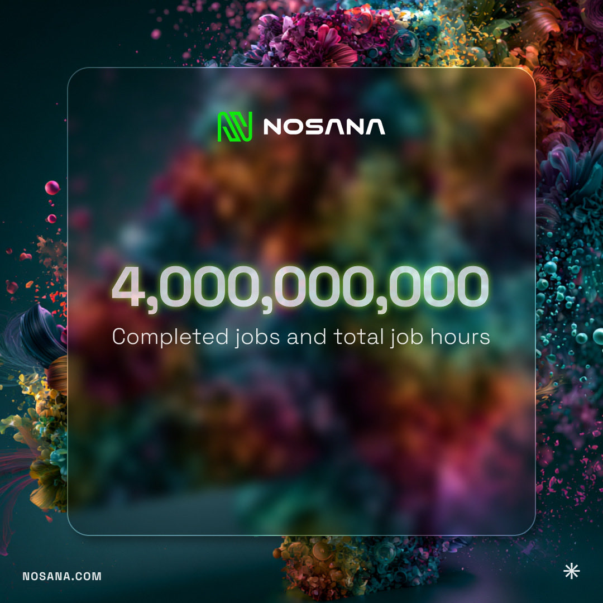
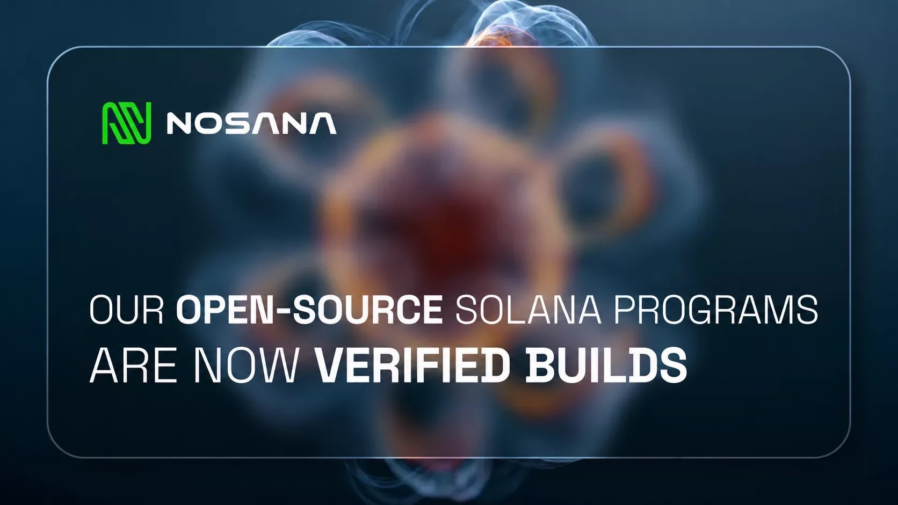
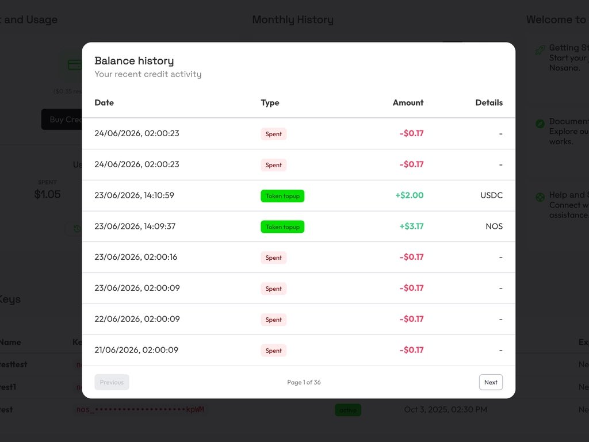

July was another milestone month for Nosana.

We crossed **4 million completed jobs**, reached **4 million total GPU job hours**, introduced new transparency features, expanded the Grants Program with exciting AI builders, powered new infrastructure products, and continued bringing together the decentralized AI ecosystem through events and live discussions.

Let's dive in.

## Network Milestones

The Nosana network reached two major milestones this month:

- **4,000,000 completed jobs**
- **4,000,000 total GPU job hours**

These numbers represent thousands of developers choosing decentralized GPUs for real production workloads, not experiments.

This is only the beginning.

👉 [https://explore.nosana.com](https://explore.nosana.com)

## Open Source. Fully Verifiable.

Transparency has always been one of Nosana's core principles.

This month, all Nosana Solana programs became **Verified Builds** on Solana Explorer.

Developers can now:

- inspect the source code
- reproduce every build
- verify every deployed program on-chain

Another important step toward production-ready decentralized infrastructure.

[Read more](https://nosana.com/blog/nosana-is-open-source/)

## From Solana DePIN to Developer-Ready GPU Cloud

Did you know Nosana originally started as a **CI/CD network**?

The real challenge wasn't pivoting toward AI.

It was making decentralized GPUs reliable enough that developers would choose them for production workloads instead of centralized cloud providers.

Our latest engineering story explores how Nosana evolved into a open-source GPU cloud.

[Read the full story.](https://nosana.com/blog/from-solana-depin-to-developer-ready-gpu-cloud/)

**Grants Program**

The Nosana Grants Program continues to support builders creating the next generation of decentralized AI infrastructure.

## **Welcoming Voight**

Nosana awarded a grant to **Voight**, an observability and identity platform for production AI agents on Solana.

Developers deploying AI agents on Nosana can now monitor:

- agent decisions
- tool usage
- transaction history
- payments
- on-chain identity

all within a single workflow.

[Read more](https://nosana.com/blog/voight-receives-a-nosana-grant/)

**Welcoming AnveVoice**

Another exciting addition to the Grants Program is **AnveVoice**.

AnveVoice enables developers to turn any application into a conversational interface powered by AI voice agents.

Together with Nosana, the team will explore decentralized GPU infrastructure for real-time, production-ready voice AI.

[Read more](https://nosana.com/blog/anvevoice-receives-a-nosana-grant/)

## Ecosystem Spotlight

#### ICPX launches on Nosana

This month, **ICPX** launched its pay-per-job GPU compute platform for AI agents.

Developers can easily deploy:

- inference
- fine-tuning
- evaluations
- model deployments

while Nosana powers the GPU infrastructure behind every workload.

[Explore ICPX](https://icpx.cloud)

If you're building the next generation of AI applications, agents, developer tools, infrastructure, or open-source projects, we'd love to hear from you. The Nosana Grants Program provides funding, decentralized GPU compute, and ecosystem support to help ambitious teams bring their ideas to production. Applications are open year-round- apply today and start building on Nosana: [https://nosana.com/grants/](https://nosana.com/grants/)

## Product Updates

#### Better credit tracking on deploy.nosana.com

Managing compute credits just became easier.

A brand new transaction history table is now available inside Deploy, allowing users to track:

- credits spent
- credits purchased
- refunds

Everything in one place.

👉 [https://deploy.nosana.com](https://deploy.nosana.com)

---

## Live Discussions

#### GPU Pricing Panel

What is driving GPU prices?

Where is the market heading?

How can decentralized infrastructure adapt?

This month's live panel featured experts from:

- Nosana
- io.net
- Aethir

[Watch the discussion](https://x.com/nosana_ai/status/2080307214670291259)

## Monthly Community Call

Missed our latest community update?

Catch up on the newest product updates, ecosystem news and network milestones.

[Watch here](https://x.com/nosana_ai/status/2082829463457243477)

## In the Spotlight

#### HackerNoon Judge Interview

Nosana Co-Founder **Sjoerd Dijkstra** shared his perspective on decentralized AI, compute infrastructure, and the future of AI builders as part of HackerNoon's Judge Spotlight series.

[Read the interview](https://hackernoon.com/judge-spotlight-sjoerd-dijkstra-co-founder-of-nosana-on-powering-ai-with-decentralized-compute)

## Events

#### Daytona HackSprint Singapore

July was packed with builder energy.

More than **20 builders** joined Daytona's HackSprint Singapore to create practical AI applications, including:

- Detonate SG — scam-link sandboxing
- BioSimulate — synthetic drug trial simulations
- SignalRoom — AI emergency planning
- Airlock — autonomous AI agent security
- Showrunner — AI-generated product launch videos

Huge thanks to our partners:

Daytona, AI&, Doubleword, Oxylabs, and everyone who helped make the event possible.

## **Nosana Use Case Highlight**

Can decentralized AI help preserve endangered languages?

This month, Nosana hosted a fascinating live session exploring how decentralized AI infrastructure can support language preservation and help make culturally important language data more accessible. It was one of the most inspiring use cases discussed this month.

Listen here: [https://x.com/nosana_ai/status/2077407947467165977](https://x.com/nosana_ai/status/2077407947467165977)

## Looking Ahead

July proved once again that decentralized AI is moving beyond theory.

Production infrastructure continues to mature.

Builders continue to ship.

The ecosystem keeps growing.

From 4 million completed jobs to new grants, developer tooling, production deployments, and ecosystem collaborations \- Nosana is building the foundation for the next generation of AI infrastructure.

See you next month. 🚀
