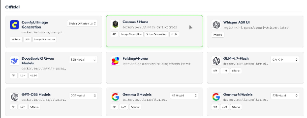
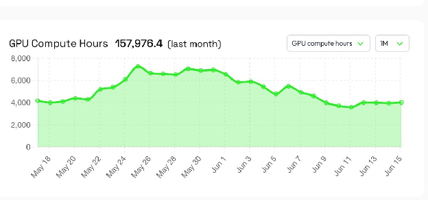
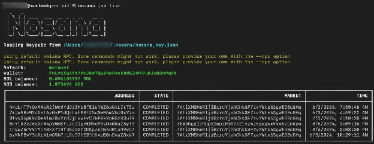
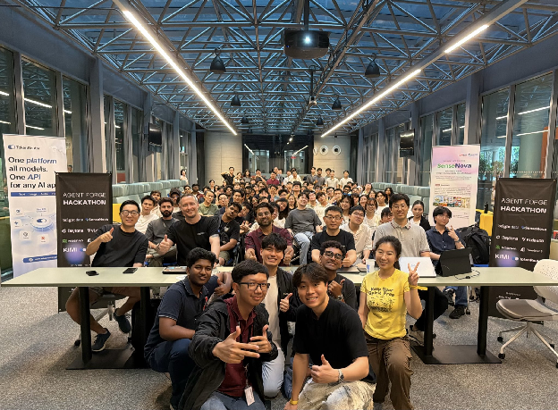

June was packed with new releases and community highlights across Nosana 🚀 The Decentralize AI Hackathon officially kicked off, new models and payment options went live, 200+ builders came together in Singapore, and product updates made deploying, funding, and tracking workloads easier ⚡

## The Decentralize AI Hackathon Is Live

The future of AI infrastructure should be open, decentralized, and builder-owned.

Nosana and HackerNoon have launched the **Decentralize AI Hackathon**, a 10-month global hackathon for builders working on open AI infrastructure.

Participants can:

* Submit an idea as a HackerNoon blog post
* Claim free Nosana compute credits
* Build and publish updates as their project evolves

[Start building](https://decentralizeai.tech)

HackerNoon also published a feature exploring why access to GPUs is becoming one of the defining infrastructure challenges in AI.

[Read it here](https://hackernoon.com/why-gpu-access-is-becoming-the-real-ai-infrastructure-battle)

**Centralized vs. Decentralized Compute**

Nosana joined Akash Network, Aethir, and io.net for a live discussion about the future of the GPU industry.

The panel explored the differences between centralized and decentralized compute, the challenges facing AI builders, and how alternative infrastructure networks can expand access to GPUs.

[Listen to the full discussion](https://x.com/nosana_ai/status/2061825575074013411?s=20)

Nosana also joined a Victus Global X Space to discuss decentralized infrastructure and the evolving AI compute landscape.

[Listen here](https://x.com/Victusglobal/status/2064370681081655308?s=20)

## NVIDIA Cosmos 3 Nano Is Live on Nosana

**NVIDIA Cosmos 3 Nano** is now available to deploy on Nosana.

The 16-billion-parameter model is designed for real-time robotics inference, physical AI applications, and workloads that need to understand and interact with the physical world.

[Try it on Nosana](https://deploy.nosana.com/deployments/create/?template=cosmos3-nano)

## Easier Ways to Start Running Workloads

It is now easier to fund your Nosana account and begin running workloads.

You can verify a payment method to claim free credits or top up your balance whenever you need additional compute.

Nosana also introduced support for purchasing credits with **NOS or USDC**. Connect your Solana wallet and pay with crypto directly, alongside the existing credit card option.

[Buy credits and deploy](https://deploy.nosana.com)

**GPU Compute Hours Added to Nosana Explore**

Nosana Explore now displays **GPU Compute Hours** alongside job count.

Job count alone does not show the full picture because jobs can vary significantly in duration and resource usage. Compute hours provide a clearer view of actual demand and activity across the network.

[Explore the network](https://explore.nosana.com)

## New CLI Command: `nosana job list`

A new command has been added to the Nosana CLI.

Run `nosana job list` to see a complete overview of your posted jobs, including addresses, states, markets, and timestamps, without leaving the terminal.

[View the documentation](https://learn.nosana.com/inference/quick_start.html#list-jobs)

## 200+ Builders Created AI Agents in Singapore

More than 200 people came together in Singapore for a one-day AI agent building event organized by Nosana partner **The AI Builders**.

By 4:30 p.m., most teams had working agents running on live data, with several projects powered by Nosana GPUs.

Congratulations to the winners and everyone who joined the event to build.

## New on the Nosana Blog

### The Real Cost of AI Agents

Running an AI agent involves more than a single model request. Tool calls, context windows, repeated reasoning steps, retries, and continuous workloads can all affect infrastructure costs.

This article breaks down where those costs come from and what builders should consider when designing agent-based applications.

[Read the article](https://nosana.com/blog/the-real-cost-of-ai-agents/)

**Why AI Apps Feel Slow**

AI application latency can come from several layers, including model inference, data transfer, orchestration, cold starts, and external tools.

Learn what causes delays and how developers can build more responsive AI applications.

[Read the article](https://nosana.com/blog/why-ai-apps-feel-slow/)

**How to Build AI Workflows That Don't Produce Slop**

When an AI workflow repeatedly generates generic or uncommitted output, the prompt is rarely the only problem.

This guide explains how clearer tasks, stronger context, and smaller workflow steps can produce more useful and reliable results.

[Read the guide](https://nosana.com/blog/how-to-build-ai-workflows-that-dont-produce-slop/)

**Can You Mine Crypto With Cloud GPUs?**

Cloud GPU mining involves several technical and economic considerations, from workload compatibility to infrastructure costs.

This article explores how mining workloads operate on cloud GPU infrastructure and how they can be run on Nosana.

[Read the article](https://nosana.com/blog/can-you-mine-crypto-with-cloud-gpus/)

**Build on Nosana**

Whether you are experimenting with AI agents, robotics, inference workloads, or open-source AI infrastructure, Nosana gives you access to distributed GPU compute without relying on traditional cloud providers.

[Start deploying](https://deploy.nosana.com)

[Join the community](https://discord.gg/nosana)

From new ways to deploy and pay to fresh models, developer tools, and community events, June brought plenty of progress across the Nosana ecosystem ⚡

More updates are already on the way. Keep building, exploring, and sharing what you create with Nosana! 🚀

## Useful Links

* [Nosana Website](https://nosana.com/)
* [Join the Discord](https://nosana.com/discord)
* [Follow us on X](https://nosana.com/twitter/)
* [Nosana on GitHub](https://nosana.com/github/)
* [Nosana Grants Program Page](https://nosana.com/grants)
