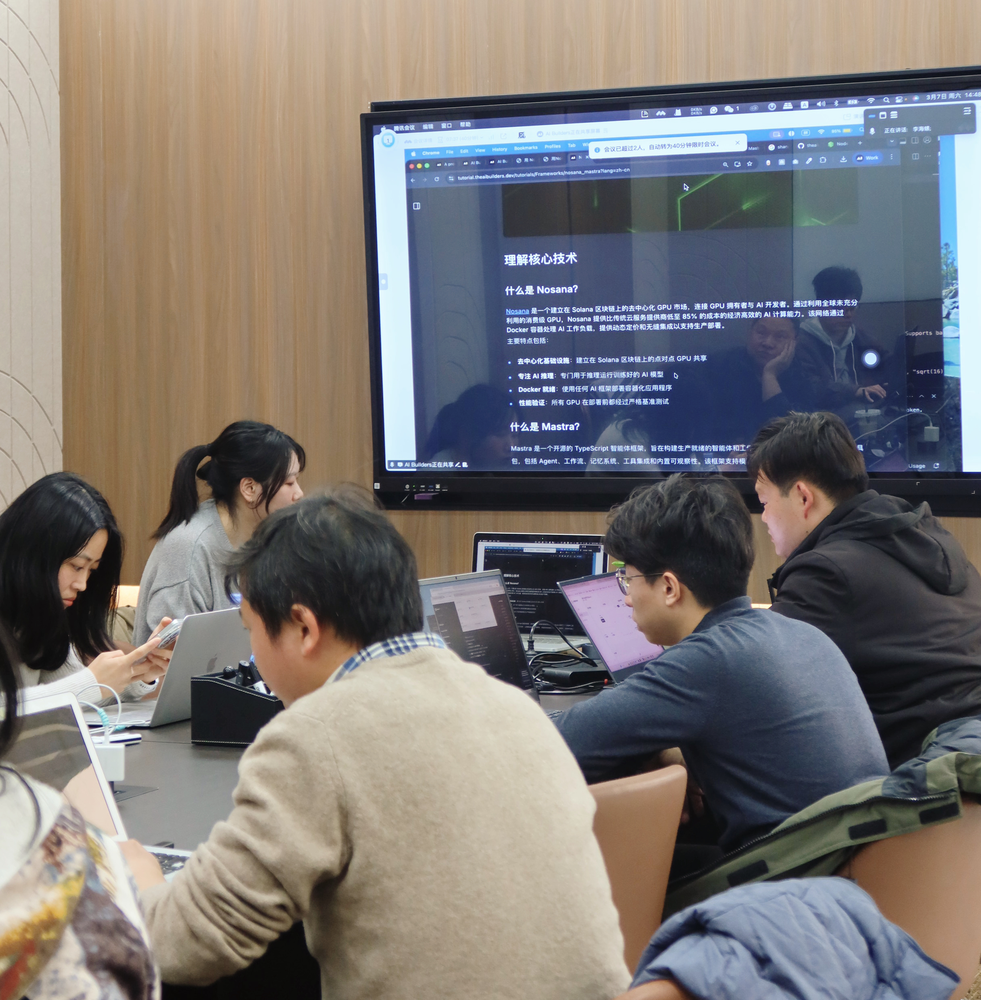
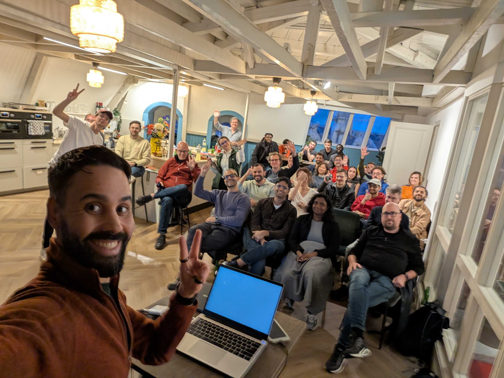

**March at Nosana: A New Experience, Built for Builders**

March was all about making Nosana faster, clearer, and more accessible — from a fully redesigned website to new tools for builders and hosts. Here's everything that happened.

---

**🚀 The New Nosana Experience Is Live**

The Nosana website has been fully upgraded. It is now faster, clearer, and built for builders from the first click.

You can now claim $50 in free GPU credits directly on the website in seconds and start running workloads immediately.

The new experience brings:

- Clearer product navigation and documentation
- A built-in GPU spend calculator
- Transparent host earnings insights
- Access to all live sessions in one place
- A better overview of network performance

This is [a new home](https://nosana.com) for building on Nosana.

**[Read more](https://nosana.com/blog/the-new-nosana-experience-is-now-live/)**

---

**⚡ Deploy Faster with the New Deploy Page**

The Nosana dashboard has evolved into a dedicated Deploy page.

You can now launch GPU workloads in a streamlined interface designed for speed and clarity.

Use Nosana GPUs with minimal setup and move from idea to running workload faster than ever.

**[Start here](https://deploy.nosana.com)**

---

**🖥 A Dedicated Hub for GPU Hosts**

We launched a dedicated hub where providers can manage everything in one place.

At [host.nosana.com](https://host.nosana.com) you can:

- Track performance and earnings
- Monitor uptime, rewards, and workload activity
- Follow step-by-step guides to become a host

One domain. One control center.

---

**📊 Real-Time Visibility into the Network**

The Nosana Explorer gives you a live view of network activity.

- Track completed workloads
- See running workloads
- Monitor total compute delivered

**[Explore](https://explore.nosana.com)**

---

**🔐 Privacy-First AI with Arcium**

We hosted a live session with Arcium focused on how to build privacy-first AI from alpha to infrastructure.

The session explored how teams can design AI systems that protect data while scaling compute.

**[Watch the session](https://x.com/i/broadcasts/1AxRnaZEVXYxl)**

---

**🌍 Expanding AI Access with Geneline X**

Geneline X by [Christex Foundation](https://www.christex.foundation/) is building voice-native AI for low-resource African languages.

Languages include Krio, Luganda, Lugbara, Ateso, Acholi, Runyankole, and Swahili.

Powered by Nosana GPUs, their models aim to make AI accessible to communities often left out of the current ecosystem.

**[Read more](https://nosana.com/blog/empowering-african-languages-with-ai-how-christex-and-geneline-x-use-nosana/)**

---

**🌏 Builders Learning by Doing**

From Shanghai to Amsterdam, builders are getting hands-on with Nosana.

In Shanghai, a workshop explored how developers can build and deploy AI agents using Nosana GPUs.

In Amsterdam, builders gathered for talks, demos, and real conversations around AI.

This is where real adoption starts.

---

**🎓 Learn with Nosana**

We continue to invest in builder education.

Our latest session walks through the full journey from documentation to deploying AI workloads.

No fluff. Just practical steps.

**[Watch here](https://www.youtube.com/watch?v=qpch51UkGOc)**

---

**🏆 Builders Challenge #4 Is Live**

This edition focuses on building AI agents with ElizaOS and deploying them on Nosana.

$3,000 in prizes. Top 10 projects get rewarded.

Build something real. Deploy it. Ship it.

Deadline: April 14.

**[Submit your project](https://superteam.fun/earn/listing/nosana-builders-elizaos-challenge)**

---

**🛠 Build with ElizaOS and Nosana**

We hosted a developer workshop focused on building AI agents with ElizaOS.

If you are participating in the challenge, this session will directly increase your chances of winning.

**[Listen here](https://x.com/nosana_ai/status/2037228166528557346?s=20)**

---

**The Bigger Picture**

More builders are entering the ecosystem.
More workloads are being deployed.
More real usage is happening.

Nosana is moving from potential to execution!

---

**Useful Links**

- [Nosana Website](https://nosana.com/)
- [Join the Discord](https://nosana.com/discord)
- [Follow us on X](https://nosana.com/x)
- [Nosana on GitHub](https://nosana.com/github)
- [Nosana Grants Program Page](https://grants.nosana.com/)
