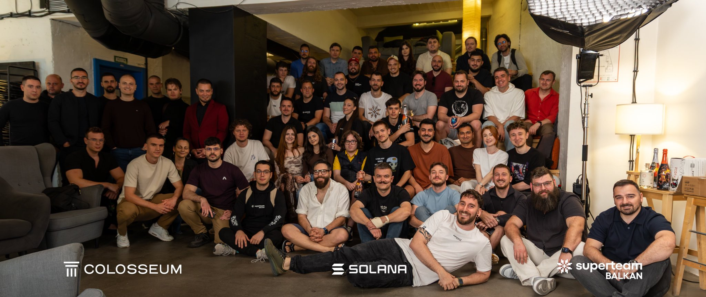
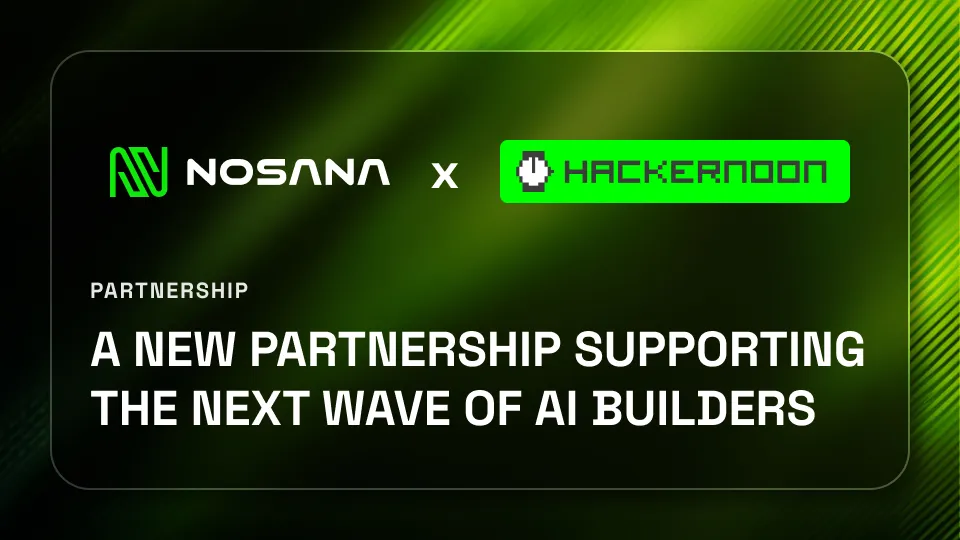
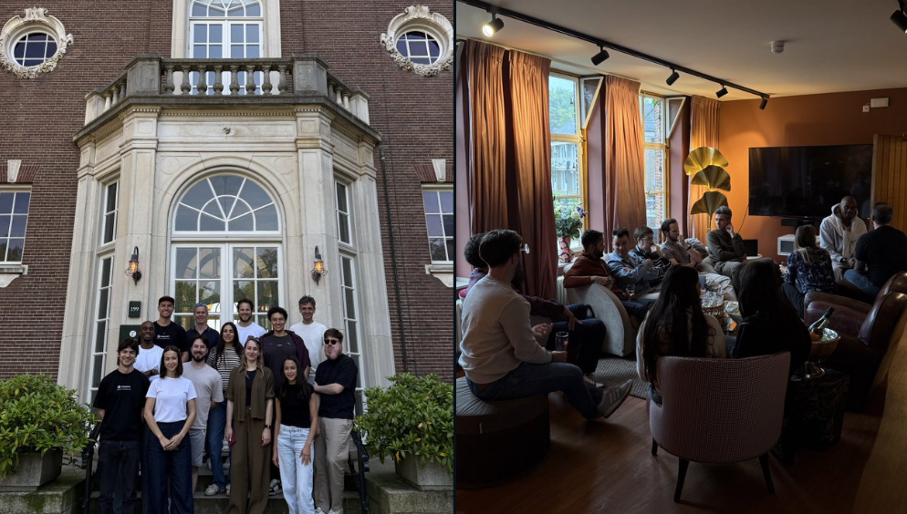

Across the network, we saw more builders experimenting with AI workloads, more teams exploring decentralized compute, and more demand for accessible GPU infrastructure. From technical education and new community-built tools to startup competitions, hackathons, partner initiatives, and growing GPU provider demand, one thing became clear: AI builders need compute that is flexible, scalable, and ready when they are.

Here’s what happened at Nosana in May.

## **Learn with Nosana Part 2: Going Deeper Into Production Workflows**

This month, we hosted **Learn with Nosana Part 2**, a technical session focused on helping builders move beyond the basics and start thinking about real production workflows.

The session covered:

- API authentication
- SDK integration
- Multi-GPU orchestration
- Optimization workflows
- Production best practices

As more builders start deploying AI workloads on Nosana, education becomes a key part of the ecosystem. The goal is not just to show people that decentralized GPU compute is possible, but to make it easier for them to actually use it in real applications.

[Watch the full session here](https://www.youtube.com/live/x1acoGzjrJw)

## **New Blog: Not All GPU Clouds Are Built for the Same Thing**

We also published a new blog comparing traditional cloud GPU providers with distributed GPU networks.

The blog looks at the differences between providers when it comes to pricing, inference, training, flexibility, and workload type. The key takeaway is simple: not every GPU cloud is built for the same user, the same workload, or the same stage of building.

[Read the full blog here](https://nosana.com/blog/cloud-gpu-providers-compared/)

**April Community Call: New Builders, Updates, and Ecosystem Progress**

In May, we also shared the recording of the April Community Call, covering recent ecosystem updates, new builders entering the network, and what has been happening across Nosana.

[Watch the recording here](https://www.youtube.com/live/GScAOKNtlSY)

**Community-Built MCP Server: Private Bulk AI Work on Your Own GPU**

One of the most exciting community-built releases this month was a new MCP server that routes bulk AI work through your own private GPU.

Built by the community, the tool supports workflows like:

- Summarization
- Code generation
- Data extraction
- Bulk AI processing

The biggest advantage is control. There is no API key, no external rate limit, and no need to send your data through a third-party model provider.

For builders who care about privacy, ownership, and self-hosted AI workflows, this is a strong example of what becomes possible when GPU compute is more accessible.

[Try it here](https://github.com/SohniSwatantra/qwen-nosana-mcp)

## **Nosana in Belgrade for the Solana Startup Competition**

The Nosana team was also in Belgrade for the Solana Startup Competition, a two-week cohort hosted by Superteam Balkans to help early-stage founders prepare for Colosseum.

A lot of the projects in the cohort had AI at the core. For many of them, the next step is not just building a prototype, but finding the right compute infrastructure to support it.

That is exactly where Nosana fits in.

As more founders build AI-native products, access to flexible GPU compute becomes a key part of the startup journey. Whether teams are experimenting with models, running inference, or preparing to scale, compute is often the gap between an idea and a product that works in the real world.

## **Nosana x HackerNoon: A New Builder-Focused Initiative**

Nosana is also teaming up with HackerNoon and leading ecosystem partners on a new builder-focused initiative.

The goal is to bring together AI, compute, and ecosystem collaboration in a way that is genuinely useful for people building with these tools.

This initiative is designed to support builders with more than just visibility. It is about giving them practical resources, access to infrastructure, and a stronger path to experiment with decentralized AI and GPU compute.

More details are coming soon.

## **Agent Forge Hackathon: 300+ Builders, 40+ Projects, 1 Day**

May also brought major builder energy in Silicon Valley with the Agent Forge Hackathon.

The event brought together:

- 300+ builders
- 40+ projects
- Teams, prototypes, and demos
- Live AI agent projects
- A full day of hands-on building

Events like this show how quickly the AI agent space is moving. Builders are not just talking about autonomous agents anymore. They are prototyping, testing, and shipping.

[See the event recap here](https://x.com/theaibuilders/status/2055866727939096921?s=46)

**Nosana Team Off-Site in the Netherlands**

The Nosana team also wrapped up an off-site in the Netherlands, a fitting location given that Nosana was born there.

The team spent the time brainstorming, aligning on priorities, digging into the work, and planning what comes next.

As Nosana grows, moments like this matter. They create space to step back, look at what is working, sharpen focus, and keep building toward the same mission: making GPU compute more accessible for AI builders and teams around the world.

## **GPU Demand on Nosana Is Rising**

One of the biggest signals from May was clear: GPU demand on Nosana is growing fast.

Markets have been full, and demand for compute continues to rise. To support this growth, Nosana is looking for more GPU providers to bring additional capacity online.

Consumer GPUs are welcome, including RTX 30, 40, and 50 series cards. With demand increasing and rates moving up, now is a strong time for GPU owners to connect their hardware to the network.

If your GPU is sitting idle, it can become part of the infrastructure powering AI workloads on Nosana.

[Start here](http://nosana.com/gpu-providers/)

**May Community Call: What Happened and What’s Coming Next**

To close the month, we hosted the May Community Call, where we went through the latest Nosana updates and shared what is coming next.

The call covered recent progress across the ecosystem, what has been happening inside the network, and where the team is focusing next.

If you missed it, you can watch the recording [here](https://www.youtube.com/watch?v=-QoRTXW42_Q)

## **Looking Ahead**

May showed the same pattern from several angles: more AI builders, more real workloads, more interest in decentralized infrastructure, and more demand for GPU capacity.

From technical education and community-built tools to hackathons, startup cohorts, and growing provider demand, the Nosana ecosystem is becoming more active across every layer.

The next step is to keep making GPU compute easier to access, easier to understand, and easier to use in real AI products.

More updates are coming soon.

## Useful Links

- [Nosana Website](https://nosana.com/)
- [Join the Discord](https://nosana.com/discord)
- [Follow us on X](https://nosana.com/twitter/)
- [Nosana on GitHub](https://nosana.com/github/)
- [Nosana Grants Program Page](https://nosana.com/grants)
