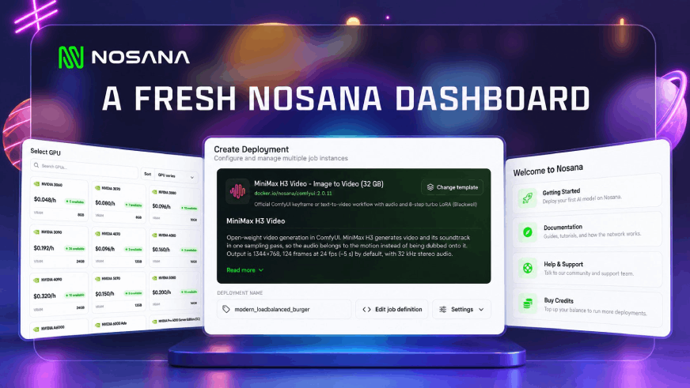
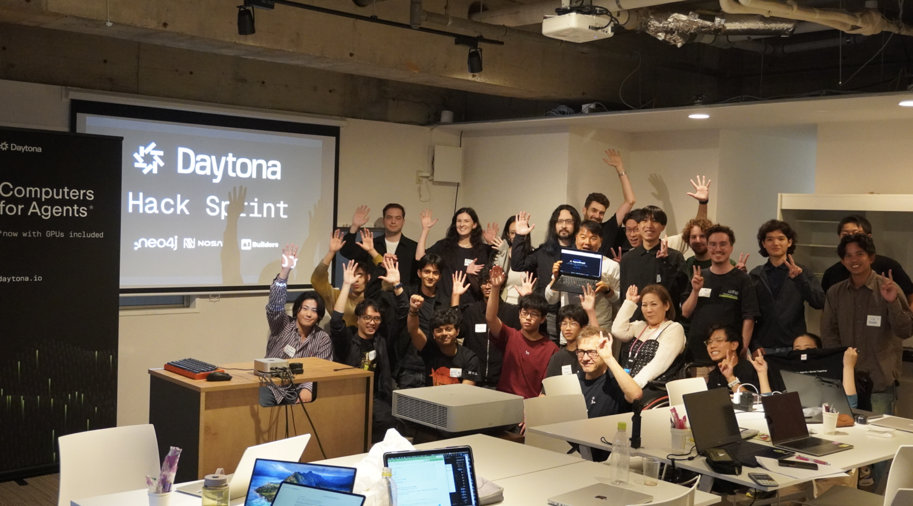
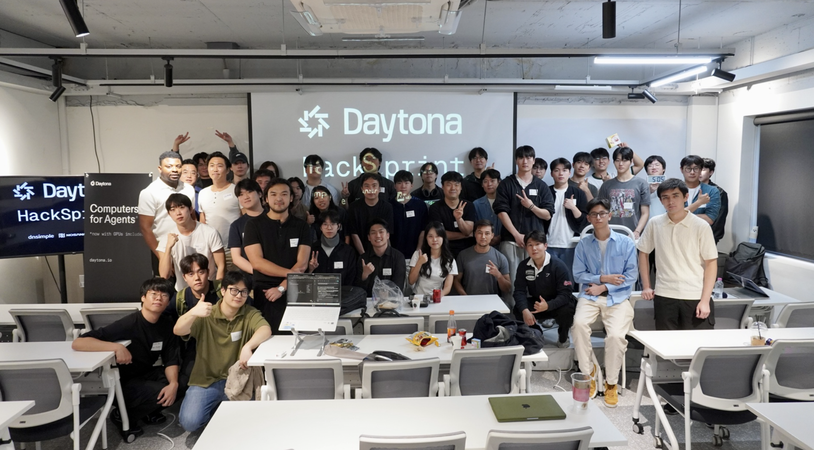
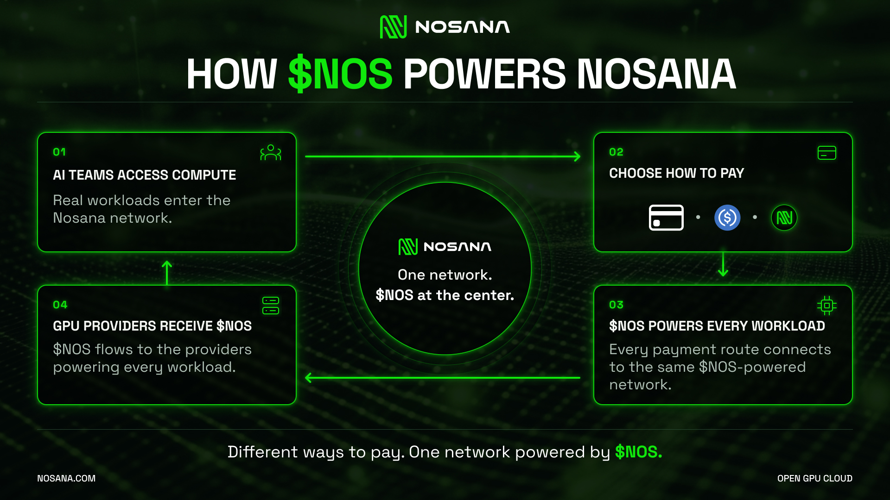

September brought big news to Nosana: our official MCP server puts GPU deployment and management inside your AI assistant, a refreshed dashboard makes building smoother, and a new RTX 4090 and RTX 5090 provider campaign helps meet growing compute demand.

We also went live with Sogni.ai to explore scaling MiniMax H3, published practical GPU guides, and supported builders turning ideas into live demos across Singapore, Tokyo and Seoul.

Here’s what happened in September.

## **Product**

### **A fresh look for Nosana Deploy**

The Nosana dashboard received a design update this month, bringing a cleaner interface and simpler navigation to the place where developers launch and manage their GPU workloads.

Whether you are setting up your first deployment or managing several workloads, the refreshed dashboard makes it easier to find your way around and focus on what you want to run.

[Explore the updated dashboard](https://deploy.nosana.com/)

### **Nosana MCP: Manage GPU Deployments Through Your AI Assistant**

The official Nosana MCP server connects your GPU infrastructure to AI assistants including Claude, Cursor and VS Code. Sign in with your Nosana account and manage your deployments in plain language.

Check GPU availability and pricing, launch a workload, investigate a failed deployment, scale replicas or track your remaining credits \- all from the assistant you already use.

For developers building with AI tools, this brings compute management into the same workflow. From choosing a GPU to checking a running deployment, your assistant can interact directly with Nosana on your behalf.

[Get started with Nosana MCP](https://learn.nosana.com/mcp/intro.html)

[See a short video demo](https://x.com/nosana_ai/status/2104890334383587444?s=20)

## **Building on Nosana**

### **Live with Sogni: Scaling MiniMax H3**

On September 1, Nosana and Sogni.ai hosted **“From AI Hype to GPU Load: Scaling MiniMax H3 with Sogni × Nosana.”**

The session focused on what happens behind the scenes as more creators start generating AI video: growing GPU demand, infrastructure costs and the challenge of expanding capacity efficiently.

Drawing on experience running MiniMax H3 workloads across Sogni and Nosana, the discussion explored how decentralized GPU infrastructure can support that growth, keep resource usage under control and make generative AI more efficient.

For developers and creative teams working with GPU-heavy models, the session connected the excitement around AI video with the practical infrastructure needed to deliver it.

[Watch the Sogni × Nosana live session](https://www.youtube.com/live/br9XYwM_qG4?si=DpDEAYRvkLyEx7ht)

### **More control over AI video with MiniMax H3**

Following its arrival in August, MiniMax H3 received a detailed deployment and workflow guide this month. It covers generating video with native audio, animating an image and directing a scene through prompts and reference inputs.

On Nosana, creators can work through the ready-to-run ComfyUI template or integrate a deployment into an application through its service URL. The guide walks through GPU selection, setup and prompting to help you move from a visual idea to your first generation.

[Start creating with MiniMax H3](https://nosana.com/blog/how-to-use-minimax-h3/)

### **Six ways to put an RTX 3090 to work**

How much can you build with 24 GB of VRAM? Our September guide explores six workloads you can deploy on RTX 3090 GPUs: text generation, AI agents, coding assistance, document OCR, image generation and speech transcription.

The examples include Qwen3.5-9B, GLM-4.7-Flash, Qwen3-Coder, Nanonets-OCR2-3B, FLUX.1 schnell and Whisper large-v3, with templates and deployment instructions for each use case.

Model precision, context length and concurrency all affect whether a workload fits and how it performs. The guide helps you choose a suitable configuration and get more from a smaller GPU budget.

[Find your RTX 3090 workload](https://nosana.com/blog/what-ai-models-can-you-run-on-an-3090/)

### **Choosing compute as your application grows**

Two more September reads tackle the decisions behind an AI deployment.

Our HackerNoon VRAM guide explains how model size, precision and workload settings affect GPU requirements. Our startup inference guide explores how teams can access compute as demand grows without buying hardware or managing their own GPU cluster.

Together, they offer a practical starting point for choosing hardware, testing realistic inputs and understanding the compute behind each user request.

[Read the VRAM guide](https://hackernoon.com/which-gpu-do-you-need-for-ai-a-practical-vram-guide) · [Explore inference for startups](https://nosana.com/blog/how-can-ai-startups-scale-inference-without-buying-or-managing-gpus/)

## **GPU Providers**

### **Your RTX 4090 or RTX 5090 is in demand**

Demand for these GPU markets has grown beyond the capacity currently available on Nosana. In September, we launched a campaign to bring more eligible RTX 4090 and RTX 5090 hosts onto the network.

Qualifying hosts receive an additional incentive equivalent to **20% daily utilization**, on top of earnings from actual customer workloads. That is the equivalent of 4.8 hours of paid work for each qualifying day.

The campaign is open to new and existing providers, subject to available spaces and eligibility requirements. Hosts must be registered, verified and maintain **at least 85% uptime each day** to receive that day’s incentive.

More reliable capacity gives developers more room to run demanding workloads while helping GPU owners put their available hardware to work.

[See the campaign and eligibility requirements](https://nosana.com/blog/rtx-4090-5090-gpu-provider-campaign/)

## **Ecosystem and Community**

### **Singapore, Tokyo, Seoul: Builders in action**

September’s event recaps took us across Asia with AI Builders.

In **Singapore**, a full-day Daytona HackSprint brought developers together for workshops, team hacking and live demos.

**Tokyo** followed with another full-day HackSprint, giving teams time to build together, present their projects and connect with other developers.

In **Seoul**, more than **80 builders** came together, formed teams and spent two hours building before presenting on stage for a chance to receive sponsor credits from Daytona and Nosana.

Thank you to everyone who joined, built and shared their work. These events give developers space to experiment, learn from each other and take an idea far enough to show it to the room.

### **Nosana is now verified on CoinMarketCap Community**

Our official CoinMarketCap Community profile received verification this month, giving the community another place to [follow Nosana’s project](https://coinmarketcap.com/community/profile/NosanaCommunity/) updates and join the conversation around the ecosystem.

### **A closer look at \$NOS**

September also brought a spotlight on the role of \$NOS in coordinating incentives between the teams using compute and the providers supplying it.

As AI workloads arrive on the network and GPU providers power them, \$NOS connects both sides of the ecosystem. Explaining that role helps our community understand how the token fits into the infrastructure people use.

[Explore the role of \$NOS](https://nosana.com/nosana-token/)

### **Jesse on the next chapter of DePIN**

Nosana co-founder Jesse Eisses contributed a piece to AlphaWire exploring what it takes for DePIN networks to succeed as AI demand shifts toward inference, agents and media generation.

The piece brings Nosana’s perspective into the broader conversation about where decentralized infrastructure can meet real demand for AI compute.

[Read Jesse’s article](https://alphawire.xyz/alphaclub/crypto-ecosystem/token-incentives-cant-outrun-real-demand-curves-in-depin)

## **Looking Ahead**

September brought easier ways to deploy, practical guidance on what to run, and a campaign to expand GPU capacity where demand is growing. Our live session with Sogni and builder events across Asia also showed the people and decisions behind those workloads.

From your first model deployment to a creative workflow or an application serving real users, there is plenty to build on Nosana.

Choose your workload. Find your GPU. Bring your next idea to life.

[Deploy an AI workload on Nosana](https://nosana.com/gpu-providers/)

## Useful Links

- [Nosana Website](https://nosana.com/)
- [Join the Discord](https://nosana.com/discord)
- [Follow us on X](https://nosana.com/twitter/)
- [Nosana on GitHub](https://nosana.com/github/)
- [Nosana Grants Program Page](https://nosana.com/grants)
