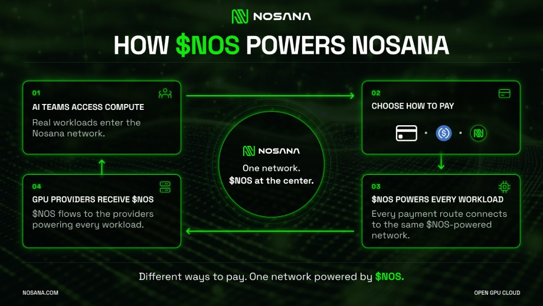

When someone uses an AI application, the infrastructure behind it usually stays out of sight. An image appears, a voice is transcribed, or an assistant returns an answer while a GPU performs the computation behind the result. For the teams building these products, that hardware is a daily consideration: their applications need affordable compute and access to capacity as usage grows.

Nosana connects these teams with a distributed network of GPU providers, bringing together the people who need compute and the operators who supply it. At the center of this ecosystem is NOS, Nosana’s native Solana-based token, which connects workload payments, provider earnings, and network incentives.

Understanding how these pieces work together reveals the token’s practical role: NOS powers the economic relationship behind the compute developers use.

## **A GPU Network Built Around Builders and Providers**

Nosana gives developers several ways to access GPU infrastructure, from a deployment dashboard to APIs, an SDK, and a CLI. A team can deploy a model through the dashboard or integrate Nosana into its development workflow, choosing the approach that suits its application.

The compute comes from GPU providers who connect their hardware to the network and make it available to run workloads. Through GPU markets, Nosana brings this capacity to builders looking for resources to power their applications.

These participants contribute different things to the ecosystem, but their needs are closely connected. Builders need suitable hardware to run their models, while providers need workloads that put their GPUs to use. NOS supports this exchange by serving as the payment asset providers receive for delivering compute.

## **How NOS Powers Nosana**

AI teams can purchase GPU credits with a credit card, USDC, or NOS. **USDC and credit card top-ups are converted into NOS, keeping the token at the center of the network’s compute economy.** GPU providers receive NOS for supplying the hardware that runs those workloads.

This flexibility makes Nosana accessible to teams with different payment preferences without requiring every builder to acquire NOS directly. Whether a team pays with a credit card, USDC, or NOS, demand for GPU compute connects back to the NOS economy.

GPU credits make the experience straightforward for developers by giving them a convenient way to access compute and manage their spending. Developers use credits to run applications, while NOS connects that activity to the providers delivering the compute.

## **Real Workloads Give NOS a Practical Role**

Consider a team building an image-generation application on Nosana. Its model runs on hardware supplied by a GPU provider, who receives NOS for delivering that compute. As people use the application to create images, the infrastructure behind those results connects the builder’s workload with the provider’s contribution.

The same relationship applies to AI assistants, speech processing, and other GPU workloads. Across these applications, NOS connects the use of the network to the operators powering it, giving the token a practical role in the delivery of GPU compute.

For hardware owners, this creates an opportunity to participate directly in the ecosystem. By contributing GPU capacity, providers can earn NOS from workloads running on their machines and track their performance and earnings through the host dashboard.

Provider incentive programs can also support participation in the network alongside workload earnings. Together, these payments and incentives connect NOS to the hardware that makes Nosana useful to builders.

## **Growing Demand, More Opportunities for GPU Providers**

Strong demand for compute on Nosana is driving the recruitment of additional GPU providers. As AI teams bring workloads to the platform, expanding the available capacity gives builders more resources to work with and creates opportunities for hardware owners to earn NOS by supplying compute.

Nosana’s recruitment of RTX 4090 and RTX 5090 providers brings this relationship into focus. Builders need GPU capacity for their applications, and providers can contribute that capacity to the network, with NOS connecting their contribution to their earnings.

As the ecosystem expands, the token’s role remains rooted in this activity: applications running on GPUs and providers receiving NOS for the compute they deliver.

## **NOS at the Center of Nosana**

The different parts of Nosana serve a shared purpose: making GPU compute accessible to builders through a network of hardware providers. The dashboard and developer tools help teams deploy applications, GPU credits simplify access to compute, and NOS connects that activity to provider earnings.

This is what places the token at the center of the ecosystem, even when a customer chooses to pay by card or USDC. Its utility reaches through the network to the operators whose machines run the workloads.

As more teams build on Nosana and more providers contribute hardware, NOS continues to connect both sides of that marketplace. Its role is grounded in the service the network delivers: GPU compute for real applications.

[Learn more about NOS](https://nosana.com/nosana-token/) or [get GPU credits and start building on Nosana](https://deploy.nosana.com/).

## Useful Links

- [Nosana Website](https://nosana.com/)
- [Join the Discord](https://nosana.com/discord)
- [Follow us on X](https://nosana.com/twitter/)
- [Nosana on GitHub](https://nosana.com/github/)
- [Nosana Grants Program Page](https://nosana.com/grants)
