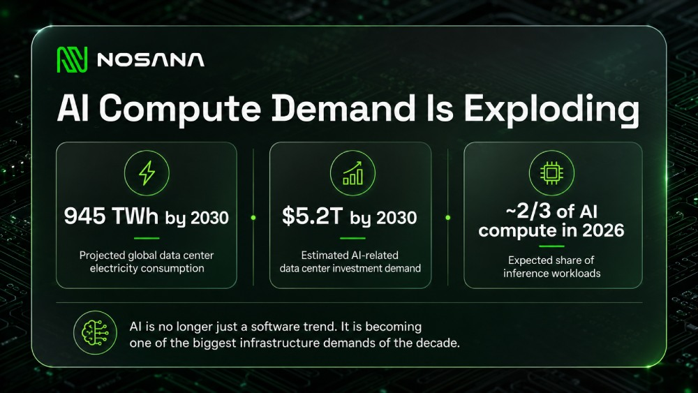

Every AI product eventually has a moment where the experience stops feeling magical and starts feeling slow. A chatbot takes too long to answer, an image generator gets stuck in a queue, an agent workflow stalls halfway through, or a transcription tool works well for one file but struggles when the workload gets heavier. From the user’s side, this usually looks like a product problem. The app feels broken, the model seems weak, or the interface appears poorly optimized. In reality, the issue often sits deeper than the product layer.

AI apps are different from traditional software because every user action can trigger a compute-heavy process in the background. A prompt is not just a message passing through a server. An image request is not just a file upload. A transcription, summary, agent task, or model call has to be processed by infrastructure that can handle the workload quickly and reliably. For many AI products, that means access to GPU compute, and when that compute is limited, expensive, overloaded, or poorly matched to the task, the user feels it immediately as waiting time, failed requests, or inconsistent performance.

This is why AI user experience is becoming an infrastructure problem. The model matters, and the interface matters, but neither can carry the product alone if the compute layer cannot keep up. A strong AI app needs fast access to the right hardware, predictable workload execution, and infrastructure economics that make sense as usage grows. Without that, even a promising product can stay trapped in demo mode: impressive enough to show, but too slow, too expensive, or too fragile to support real users at scale.

## **AI Apps Are Not Normal SaaS Products**

Traditional software usually scales around storage, bandwidth, databases, and application servers. Those things still matter in AI products, but they are no longer the whole story. AI apps add a heavier layer on top: inference, model execution, GPU memory, orchestration, and often multiple processing steps for a single user request. A normal SaaS product might send a query to a database and return a result. An AI product may need to run a model, process a file, generate tokens, create an image, transcribe audio, summarize output, call another tool, and return something useful in a format the user can understand.

This is why AI products can become expensive and slow much earlier than traditional apps. The moment usage grows, infrastructure demand grows with it. It is not just “more users” in the usual software sense. It is more users asking the system to perform compute-heavy work again and again. A single feature can be cheap in a demo and expensive in production because every real user interaction creates ongoing compute demand.

## **The Hidden Bottleneck Is Compute Access**

The AI industry talks a lot about models, but models are only useful when they have somewhere to run. For builders, the practical question is not only which model performs best, but whether the infrastructure can support the workload at the right speed and cost. This becomes especially important for teams building AI agents, image and video tools, transcription products, open-source model workflows, rendering pipelines, simulations, or other GPU-heavy applications.

When compute access is limited, the product suffers in ways users immediately notice. Requests take longer, queues appear, costs rise, and teams start making compromises. They may limit usage, reduce quality, delay features, or increase prices. None of this feels like an infrastructure issue from the outside, but that is exactly what it is. The user does not see GPU availability, workload routing, or backend cost pressure. They only see that the product is slower, more expensive, or less reliable than expected.

The scale of this problem is growing quickly. The International Energy Agency projects that global data center electricity consumption will more than double to around 945 TWh by 2030, with AI as the most important driver of that growth. McKinsey estimates that companies across the compute power value chain may need to invest $5.2 trillion into data centers by 2030 to meet worldwide demand for AI alone. Deloitte also expects inference workloads to account for roughly two-thirds of AI compute in 2026, which matters because inference is the ongoing cost of using AI products after models are trained.

Sources: [IEA, _Energy and AI_](https://www.iea.org/reports/energy-and-ai/energy-demand-from-ai), [McKinsey, _The Cost of Compute_](https://www.mckinsey.com/industries/technology-media-and-telecommunications/our-insights/the-cost-of-compute-a-7-trillion-dollar-race-to-scale-data-centers), [Deloitte, _More Compute for AI, Not Less_](https://www.deloitte.com/us/en/insights/industry/technology/technology-media-and-telecom-predictions/2026/compute-power-ai.html)

## **Inference Is Where AI Becomes Expensive**

Training gets most of the attention because it sounds bigger and more dramatic. But for many AI products, inference is where the long-term cost shows up. Inference is what happens every time a user asks the model to do something. It is the chatbot answer, the generated image, the audio transcription, the document summary, the agent action, or the recommendation returned by the system.

That means inference is not a one-time infrastructure event. It is the recurring cost of making the product useful. The more users interact with an AI app, the more compute the app needs. This creates a different growth pattern from normal software. In traditional SaaS, more usage can often improve margins over time. In AI products, more usage can create more infrastructure pressure unless the team has a clear compute strategy.

This is why many AI products feel strong in demos but struggle when usage becomes real. A demo can absorb delays, manual workarounds, and inefficient infrastructure. A production product cannot. Once users expect the product to work repeatedly and reliably, the compute layer becomes part of the product experience. If the workload cannot run efficiently, the product cannot scale well, no matter how good the concept is.

## **Why Builders Need More Flexible GPU Infrastructure**

The default answer for many teams has been to use large centralized cloud providers. That infrastructure is powerful and mature, but it is not always the best fit for every stage of AI development. Early builders often need flexibility more than long-term commitments. They need to test workloads, compare performance, understand costs, and see whether the product has real demand before locking themselves into heavy infrastructure spend.

This is especially true for teams experimenting with open-source models, agent workflows, and GPU-intensive applications that may change quickly. The workload you test this month may not be the workload you run three months later. The model may change, the user flow may change, the cost profile may change, and the product may need a different type of compute as it matures. In that environment, infrastructure needs to be practical, accessible, and easy to experiment with.

The broader point is simple: AI needs more than better models. It needs better access to compute. The next wave of AI products will depend on whether builders can run workloads affordably and reliably enough to move from idea to production. Without that, the market gets flooded with impressive demos that are too slow, too expensive, or too fragile to become useful products.

## **Where [Nosana](https://nosana.com/) Fits In**

This is where Nosana becomes relevant. Nosana is not trying to be another generic cloud provider with a different pricing page. It is building an open-source GPU cloud that makes distributed compute actually usable for AI teams. The network connects available GPU capacity with developers who need to run workloads, so builders can move faster from prototype to execution without depending on the traditional cloud model.

For builders, Nosana offers a practical way to run GPU workloads on demand. That can include AI inference, model-related workloads, rendering, simulations, agent workflows, and other compute-heavy tasks. Instead of treating compute as something locked behind large cloud commitments, Nosana gives teams a way to start testing, understand performance, and continue building based on actual usage.

Before running a workload, builders can also estimate the cost. Nosana’s GPU workloads page lets you calculate expected pricing based on GPU type, runtime, and workload requirements, making it easier to plan compute spend before you start testing. [Estimate your workload cost,](https://nosana.com/gpu-workloads/) top up your credits, and run it on Nosana.

This matters because the AI infrastructure problem is not abstract anymore. If you are building an AI product, your compute layer affects your speed, costs, reliability, and ability to scale. Nosana gives developers a way to work directly with that layer instead of only talking about it. You can run workloads, see how they perform, and evaluate whether decentralized GPU compute makes sense for your product.

## **Conclusion: AI Performance Starts Below the Product Layer**

When an AI app feels slow, unreliable, or too expensive to use at scale, the problem is not always the model or the interface. Very often, it is the infrastructure underneath the product. Every generation, transcription, agent task, simulation, or model call depends on compute being available at the right time, at the right cost, and with enough reliability to support real usage.

That is the main shift AI builders need to understand. Compute is no longer a background technical detail that can be solved later. It shapes the user experience, the cost structure, the speed of experimentation, and the path from prototype to production. A product that works in a demo can still fail in the real world if the workload is too expensive, too slow, or too difficult to scale.

The next generation of AI products will not be defined only by better prompts, cleaner interfaces, or more powerful models. It will also be defined by better infrastructure choices. Builders who understand where their workloads run, how much they cost, and how they scale will have a stronger chance of turning AI ideas into products people can actually use.

Nosana is building for that reality by giving developers access to GPU compute for real workloads, not just theoretical infrastructure planning. If you are building with AI, start by understanding your workload. Estimate the cost, top up your credits, run it on Nosana, and see what your product actually needs before infrastructure becomes the bottleneck. Start building on [Nosana.](https://nosana.com/)

## Useful Links

- [Nosana Website](https://nosana.com/)
- [Join the Discord](https://nosana.com/discord)
- [Follow us on X](https://nosana.com/twitter/)
- [Nosana on GitHub](https://nosana.com/github/)
- [Nosana Grants Program Page](https://nosana.com/grants)
